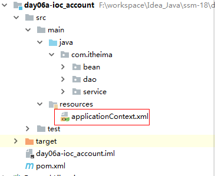
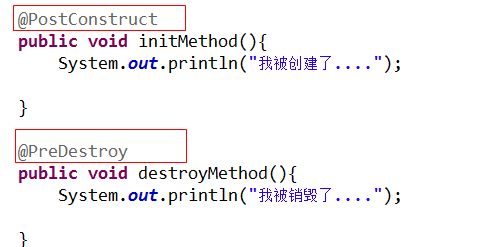
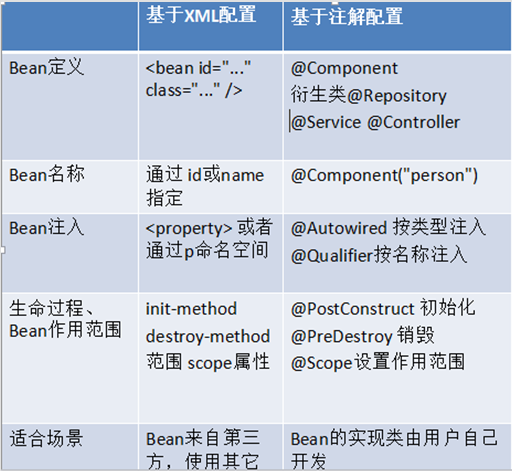

# spring5第二天

# 学习目标

- [ ] 能够实现spring基于注解的IoC案例
- [ ] 能够编写spring的IOC的注解代码
- [ ] 能够编写spring使用注解实现组件扫描
- [ ] 能够说出spring的IOC的相关注解的含义
- [ ] 够实现spring基于XML的IoC案例
- [ ] 能够实现spring框架整合JUnit

# 第一章-作业讲解 

## 作业-使用Spring的IoC的实现账户的CRUD 

### 1.目标

- [ ] 够实现spring基于XML的IoC案例

### 2.分析

1. 环境搭建
2. 创建applicationContext.xml
   + new的地方就注册
   + 对象需要的字段 我们就注入
3. 启动Spring容器,测试

### 3.实现

#### 3.1环境搭建

1. 创建Maven工程,导入坐标

```xml
  <dependencies>
    <dependency>
      <groupId>com.alibaba</groupId>
      <artifactId>druid</artifactId>
      <version>1.0.14</version>
    </dependency>

    <dependency>
      <groupId>commons-dbutils</groupId>
      <artifactId>commons-dbutils</artifactId>
      <version>1.4</version>
    </dependency>
    <dependency>
      <groupId>mysql</groupId>
      <artifactId>mysql-connector-java</artifactId>
      <version>5.1.6</version>
    </dependency>
    <dependency>
      <groupId>junit</groupId>
      <artifactId>junit</artifactId>
      <version>4.12</version>
      <scope>test</scope>
    </dependency>
    <dependency>
      <groupId>org.springframework</groupId>
      <artifactId>spring-context</artifactId>
      <version>5.0.2.RELEASE</version>
    </dependency>
  </dependencies>
```

2. 创建数据库和编写实体类

   数据库

```sql
create table account(
    id int primary key auto_increment,
    name varchar(40),
    money double
)character set utf8 collate utf8_general_ci;

insert into account(name,money) values('zs',1000);
insert into account(name,money) values('ls',1000);
insert into account(name,money) values('ww',1000);
```

​		实体

```java
public class Account implements Serializable{
    private Integer id;
    private String name;
    private Double money;
}
```

3. 编写持久层代码

   AccountDao.java

```java
public interface AccountDao {

    void save(Account account) throws SQLException;

    void update(Account account) throws SQLException;

    void delete(Integer id) throws SQLException;

    Account findById(Integer id) throws SQLException;

    List<Account> findAll() throws SQLException;

}
```

​		AccountDaoImpl.java

```java
public class AccountDaoImpl implements AccountDao {

    private QueryRunner queryRunner;

    public void setQueryRunner(QueryRunner queryRunner) {
        this.queryRunner = queryRunner;
    }

    @Override
    public void save(Account account) throws SQLException {
        //3. 执行sql语句
        queryRunner.update("insert into values(?,?,?)",null,account.getName(),account.getMoney());

    }

    @Override
    public void update(Account account) throws SQLException {
        //3. 执行sql语句
        queryRunner.update("update account set name=?,money=? where id=?",account.getName(),account.getMoney(),account.getId());

    }

    @Override
    public void delete(Integer id) throws SQLException {
        //3. 执行sql语句
        queryRunner.update("delete from  account  where id=?",id);

    }

    @Override
    public Account findById(Integer id) throws SQLException {
        //3. 执行sql语句
        return queryRunner.query("select * from  account  where id=?",new BeanHandler<Account>(Account.class),id);
    }

    @Override
    public List<Account> findAll() throws SQLException {
        //3. 执行sql语句
        return queryRunner.query("select * from  account ",new BeanListHandler<Account>(Account.class));
    }
}
```

4. 编写业务层代码

   AccountService.java

```java
public interface AccountService {
    void save(Account account) throws Exception;

    void update(Account account) throws Exception;

    void delete(Integer id) throws Exception;

    Account findById(Integer id) throws Exception;

    List<Account> findAll() throws Exception;

}
```

​		AccountServiceImpl.java

```java
public class AccountServiceImpl implements AccountService {

    private AccountDao accountDao;

    public void setAccountDao(AccountDao accountDao) {
        this.accountDao = accountDao;
    }

    @Override
    public void save(Account account) throws Exception {
        accountDao.save(account);

    }

    @Override
    public void update(Account account) throws Exception {
        accountDao.update(account);

    }

    @Override
    public void delete(Integer id) throws Exception {
        accountDao.delete(id);
    }

    @Override
    public Account findById(Integer id) throws Exception {
        return  accountDao.findById(id);
    }

    @Override
    public List<Account> findAll() throws Exception {
        return  accountDao.findAll();
    }
}
```

#### 3.2配置步骤

+ 创建applicationContext.xml




```xml
<?xml version="1.0" encoding="UTF-8"?>
<beans xmlns="http://www.springframework.org/schema/beans"
       xmlns:xsi="http://www.w3.org/2001/XMLSchema-instance"
       xsi:schemaLocation="http://www.springframework.org/schema/beans http://www.springframework.org/schema/beans/spring-beans.xsd">
    <!--注册AccountService-->
    <bean id="accountService" class="com.itheima.service.impl.AccountServiceImpl">
        <property name="accountDao" ref="accountDao"/>
    </bean>
    <!--注册accountDao-->
    <bean id="accountDao" class="com.itheima.dao.impl.AccountDaoImpl">
        <property name="queryRunner" ref="queryRunner"/>
    </bean>
    <!--注册queryRunner-->
    <bean id="queryRunner" class="org.apache.commons.dbutils.QueryRunner">
        <constructor-arg name="ds" ref="dataSource"/>
    </bean>
    <!--注册数据源-->
    <bean id="dataSource" class="com.alibaba.druid.pool.DruidDataSource">
        <property name="url" value="jdbc:mysql://localhost:3306/spring_day02?characterEncoding=utf8"/>
        <property name="driverClassName" value="com.mysql.jdbc.Driver"/>
        <property name="username" value="root"/>
        <property name="password" value="123456"/>
    </bean>
</beans>
```

#### 3.3测试案例

```java
public class DbTest {
    @Test
    public void fun01() throws Exception {
        ApplicationContext applicationContext = new ClassPathXmlApplicationContext("applicationContext.xml");
        AccountService accountService = (AccountService) applicationContext.getBean("accountService");
        List<Account> list = accountService.findAll();
        System.out.println(list);
    }
}
```

### 4.小结

1. 自己new的地方就注册
2. 给对象字段赋值的地方就注入(构造方法, Set方法) 

# 第二章-Spring的IOC注解开发

​	学习基于注解的 IoC 配置，大家脑海里首先得有一个认知，即注解配置和 xml 配置要实现的功能都是一样的，都是要降低程序间的耦合。只是配置的形式不一样。
​	关于实际的开发中到底使用 xml 还是注解，每家公司有不同的习惯。所以这两种配置方式我们都需要掌握。 

## 案例-注解开发入门

### 1.目标

- [ ] 能够编写spring的IOC的注解代码(代替xml里面配置的Bean标签)

### 2.分析

1. 创建工程 导入坐标
2. 在类上面添加注解@Component
3. 在applicationContext.xml 开启包扫描


### 3.实现

#### 3.1创建Maven工程,添加依赖

```xml
<dependencies>
    <dependency>
    <groupId>org.springframework</groupId>
    <artifactId>spring-context</artifactId>
    <version>5.0.2.RELEASE</version>
    </dependency>
 </dependencies>
```

#### 3.2使用@Component注解配置管理的资源

- eg: 需要给AccountServiceImpl

```java
@Component("accountService")
public class AccountServiceImpl implements AccountService {} // 等同于 在xml里面,<bean id="accountService" class="具体的类">
```

#### 3.3引入context的命名空间

+ applicationContext.xml中需要引入context的命名空间,可在xsd-configuration.html中找到

```xml
<beans xmlns="http://www.springframework.org/schema/beans"
       xmlns:xsi="http://www.w3.org/2001/XMLSchema-instance"
       xmlns:context="http://www.springframework.org/schema/context" xsi:schemaLocation="
        http://www.springframework.org/schema/beans http://www.springframework.org/schema/beans/spring-beans.xsd
        http://www.springframework.org/schema/context http://www.springframework.org/schema/context/spring-context.xsd">


</beans>
```

#### 3.4 配置扫描

在bean标签内部，使用context:component-scan ，让spring扫描该基础包下的所有子包注解

```xml
<context:component-scan base-package="com.itheima"></context:component-scan>
```
### 4.小结

1. 在类上面添加@Component("id")
2. 在Spring配置文件里面开启包扫描


## 案例-注解开发进阶

### 1.目标

- [ ] 能够编写spring使用注解实现组件扫描
- [ ] 能够说出spring的IOC的相关注解的含义

### 2.路径

1. 用于创建对象的注解
2. 用于改变作用范围的注解
3. 和生命周期相关的注解

### 3.讲解

#### 3.1用于创建对象的

相对于`相当于： <bean id="" class=""> `

##### 3.1.1@Component 

作用：
​	把资源让 spring 来管理。相当于在 xml 中配置一个 bean。
属性：
​	value：指定 bean 的 id。如果不指定 value 属性，默认 bean 的 id 是当前类的类名。首字母小写。 

##### 3.1.2@Controller @Service @Repository 

​	web里面的三层结构 中的所有类，在spring里面都称之为 Component （组件） ， 但是它也提供了更详细的注解来针对不同的层级声明 。

​	三个衍生注解如下:

       		 	 @Controller               :修饰WEB层类	 --->action | SpringMVC 

      		  	 @Service                    :修饰业务层类	 --->service

      		  	 @Repository             :修饰DAO层类	 --->dao


​	在需要spring创建对象的类上面使用注解 @Component(“us”) 即可.Spring看类上是否有该注解，如果有该注解，生成这个类的实例。如果不指定value值， 那么默认的id值就是类名的名字， 第一个字母小写.

#### 3.2用于改变作用范围的@scope

@scope

​	singleton: 单例(默认)

​	prototype:多例

​	@Scope注解用来描述类的作用范围的，默认值singleton。如同xml中bean标签的属性scope `<bean scope=""/>`.如果配置成多例的使用prototype。

```java
@Scope("prototype")
@Component("accountService")
public class AccountServiceImpl implements AccountService {}
```
#### 3.3和生命周期相关的【了解】

+ 初始化和销毁回调方法对应的注解

  ​	@PostConstrut:如同xml中bean标签的属性init-method `<bean init-method=""/>`,用来设置spring框架初始化此类实例时调用的初始化方法,标注在此类的初始化方法上

  ​	@PreDestroy:如同xml中bean标签的属性init-method `<bean destroy-method=""/>`,用来设置spring框架销毁此类实例时调用的销毁方法,标注在此类的销毁方法上

  > 注意:这两个注解都是配在方法上的

  

### 4.小结

1. 注册Bean的 相当于配置了 ` <bean id="" class=""/>`
   + @Component("id")
   + @Controller("id")
   + @Service("id")
   + @Repository("id")

2. 改变作用范围 相当于配置了 ` <bean scope=""/>`

   + @Scope("")

3. 生命周期相关的     `<bean init-method=""  destroy-method=""/>`

   + @PostConstruct 
   + @PreDestroy

   > 注意: 这两个注解作用在方法上面

## 知识点-使用注解注入属性

### 1.目标

- [ ] 掌握使用注解注入属性

### 2.路径

1. @Value : 注入简单类型的数据
2. @Autowired 
3. @Qualifier
4. @Resource

### 3.讲解

#### 3.1@Value 

+ 作用：

  注入基本数据类型和 String 类型数据的

+ 属性：

  value：用于指定值 , 可以通过表达式动态获得内容再赋值

+ 实例:

```java
@Value("奥巴马")
private String name;  
```
#### 3.2@Autowired 

+ 作用：

  ​	自动按照类型注入。当使用注解注入属性时， set 方法可以省略。它只能注入其他 bean 类型。

  ​	如果只有一个实现类, 可以自动注入成功

  ​	如果有两个或者两个以上的实现类, 找到变量名一致的id对象给注入进去, 如果找不到,就报错 

+ 实例:

```java
@Component("accountService")
public class AccountServiceImpl implements AccountService {
    @Autowired
    //当有多个AccountDao实现类时候, @Autowired会在在Spring容器里面找id为accountDao的对象注入,找不到就报错
    private AccountDao accountDao;
    @Override
    public void save() {
        System.out.println("AccountServiceImpl---save()");
        accountDao.save();
    }
}
```

#### 3.3@Qualifier

+ 作用

      在自动按照类型注入(@Autowired)的基础之上，再按照Bean的id注入。

  ​	它在给字段注入时不能独立使用，必须和@Autowire一起使用；

  ​	但是给方法参数注入时，可以独立使用。

+ 属性

  ​	value：指定bean的id。

+ 实例

```java
@Component("accountService")
public class AccountServiceImpl implements AccountService {
    @Autowired
    @Qualifier(value = "accountDao02")
    private AccountDao accountDao;
    @Override
    public void save() {
        System.out.println("AccountServiceImpl---save()");
        accountDao.save();
    }
}
```

#### 3.4@Resource

如果上面一个接口有多种实现，那么现在需要指定找具体的某一个实现，那么可以使用@Resource

```java
@Component("accountService")
public class AccountServiceImpl implements AccountService {
    @Resource(name = "accountDao02")
    private AccountDao accountDao;
    @Override
    public void save() {
        System.out.println("AccountServiceImpl---save()");
        accountDao.save();
    }
}
```

### 4.小结

1. 注入简单类型  @Value("值/表达式")
2. 注入对象类型
   + 如果只有一个bean的情况, 建议使用@AutoWired
   + 如果有多个bean的情况, 建议使用@Resource(name = "id")


## 知识点-混合开发

### 1.目标

- [ ] 掌握混合(xml和注解)开发

### 2.路径

1.  注解和XML开发比较
2. 混合开发特点
3. 混合开发环境搭建

### 3.讲解

#### 3.1注解和XML比较




+ xml
  + 优点: 方便维护, 改xml文件
  + 缺点: 相对注解而言, 麻烦一点
+ 注解
  + 优点: 开发简洁方便
  + 缺点: 维护没有xml那么方便, 需要改源码
    
    

#### 3.2混合开发特点

​	使用xml(==注册==bean)来管理bean,

​	使用注解来==注入==属性 

#### 3.3混合开发环境搭建

+ 创建spring配置文件，编写头信息配置

  ```xml
  <?xml version="1.0" encoding="UTF-8"?>
  <beans xmlns="http://www.springframework.org/schema/beans"
  xmlns:xsi="http://www.w3.org/2001/XMLSchema-instance" xmlns:context="http://www.springframework.org/schema/context"
  xsi:schemaLocation="
       http://www.springframework.org/schema/beans http://www.springframework.org/schema/beans/spring-beans.xsd
       http://www.springframework.org/schema/context http://www.springframework.org/schema/context/spring-context.xsd
       ">
  </beans>
  ```

+ 配置扫描

  ```xml
  <context:component-scan base-package="com.itheima" />
  ```

+ 在xml配置中添加Bean的管理

+ 在被管理bean对应的类中，为依赖添加注解配置

### 4.小结

1. xml来注册(配置bean标签)
2. 注解来注入(@Value, @AutoWired, @Resource)


## 案例-使用注解改造作业

### 1.需求

- [ ] 使用注解改造作业

### 2.分析

1. 在业务类上面添加@Service
2. 在Dao类上面添加@Repository
3. 在业务类注入Dao对象 使用@AutoWired
4. 在Dao类注入QueryRunner对象  使用@AutoWired
5. 开启包扫描

### 3.实现

+ 使用注解配置持久层

```java
@Repository("accountDao")
public class AccountDaoImpl implements AccountDao {

    @Autowired
    private QueryRunner queryRunner;
	...
}
```

+ 使用注解配置业务层

```java
@Service("accountService")
public class AccountServiceImpl implements AccountService {
    @Autowired
    private AccountDao accountDao;
    ...
}
```

+ 修改applicationContext.xml

```xml
<?xml version="1.0" encoding="UTF-8"?>
<beans xmlns="http://www.springframework.org/schema/beans"
       xmlns:xsi="http://www.w3.org/2001/XMLSchema-instance"
       xmlns:context="http://www.springframework.org/schema/context"
       xsi:schemaLocation="http://www.springframework.org/schema/beans http://www.springframework.org/schema/beans/spring-beans.xsd http://www.springframework.org/schema/context http://www.springframework.org/schema/context/spring-context.xsd">

    <context:component-scan base-package="com.itheima"></context:component-scan>

    <!--注册queryRunner-->
    <bean id="queryRunner" class="org.apache.commons.dbutils.QueryRunner">
        <constructor-arg name="ds" ref="dataSource"/>
    </bean>
    <!--注册数据源-->
    <bean id="dataSource" class="com.alibaba.druid.pool.DruidDataSource">
        <property name="url" value="jdbc:mysql://localhost:3306/spring_day02?characterEncoding=utf8"/>
        <property name="driverClassName" value="com.mysql.jdbc.Driver"/>
        <property name="username" value="root"/>
        <property name="password" value="123456"/>
    </bean>
</beans>
```

### 4.小结

1. 把 `<bean></bean>` 改成注解
   + 业务类  @Service
   + Dao类  @Repository
2. 把`<property></property>` 改成注解
   + 业务类注入Dao  @Autowired
   + Dao注入QueryRunner  @Autowired


## 案例-使用纯注解改造作业	

### 1.需求

- [ ] 使用纯注解改造作业

### 2.分析

​	基于注解的IoC配置已经完成，但是大家都发现了一个问题：我们依然离不开spring的xml配置文件，那么能不能不写这个bean.xml，所有配置都用注解来实现呢？

​	当然，同学们也需要注意一下，我们选择哪种配置的原则是简化开发和配置方便，而非追求某种技术  

​	学习纯注解开发原因:

1. 方便大家学习SpringBoot  
2. 以防万一真遇到了Spring纯注解开发

```xml
<?xml version="1.0" encoding="UTF-8"?>
<beans xmlns="http://www.springframework.org/schema/beans"
       xmlns:xsi="http://www.w3.org/2001/XMLSchema-instance"
       xmlns:context="http://www.springframework.org/schema/context"
       xsi:schemaLocation="http://www.springframework.org/schema/beans http://www.springframework.org/schema/beans/spring-beans.xsd http://www.springframework.org/schema/context http://www.springframework.org/schema/context/spring-context.xsd">

    <!--1.定义一个配置类@Configuration , 代替配置文件
        2.使用@ComponentScan在配置类里面开启包扫描
        3.在配置类里面定义一个方法 创建dataSource, 通过@Bean存到Spring容器里面
        4.在配置类里面定义一个方法 创建queryRunner, 通过@Bean存到Spring容器里面
        5.使用注解方式的工厂
    -->

    <!--开启包扫描-->
    <context:component-scan base-package="com.itheima"/>

    <!--注册dataSource  自己new一个dataSource(set四次)-->
    <bean id="dataSource" class="com.alibaba.druid.pool.DruidDataSource">
        <property name="url" value="jdbc:mysql://localhost:3306/spring_day02?characterEncoding=utf8"></property>
        <property name="driverClassName" value="com.mysql.jdbc.Driver"></property>
        <property name="username" value="root"></property>
        <property name="password" value="123456"></property>
    </bean>

    <!-- 注册queryRunner-->
    <bean id="queryRunner" class="org.apache.commons.dbutils.QueryRunner">
        <constructor-arg name="ds" ref="dataSource"></constructor-arg>
    </bean>


</beans>
```

### 3.实现

#### 3.1 @Configuration 

+ 作用：

  用于指定当前类是一个spring配置类，当创建容器时会从该类上加载注解。

  获取容器时需要使用AnnotationApplicationContext(类.class)。

+ 属性：

  value:用于指定配置类的字节码

+ 示例代码:

```java
@Configuration
public class SpringConfiguration {

}
```

#### 3.2 @ComponentScan

+ 作用：

  用于指定spring在初始化容器时要扫描的包。作用和在spring的xml配置文件中的： `<context:component-scan base-package="com.itheima"/>`是一样的。

+ 属性：

  basePackages：用于指定要扫描的包。和该注解中的value属性作用一样。

+ 示例代码:

```java
@Configuration
@ComponentScan("com.itheima")
public class SpringConfiguration {

}
```

#### 3.3@Bean

+ 作用：

  该注解只能写在方法上，表明使用此方法创建一个对象，并且放入spring容器。

+ 属性：

  name：给当前@Bean注解方法创建的对象指定一个名称(即bean的id）。

+ 示例代码:

```java
/**
 * 该类是一个配置类，它的作用和bean.xml是一样的
 */
@Configuration
@ComponentScan("com.itheima")
public class SpringConfiguration {

    private String driver = "com.mysql.jdbc.Driver";
    private String url = "jdbc:mysql:///spring_day02";
    private String username = "root";
    private String password = "123456";
    /**
     * 用于创建一个QueryRunner对象
     * @param dataSource
     * @return
     */
    @Bean("runner")
    public QueryRunner createQueryRunner(@Qualifier(value ="dataSource") DataSource dataSource){
        return new QueryRunner(dataSource);
    }
    /**
     * 用于创建DataSource
     * @return
     * @throws PropertyVetoException
     */
    @Bean(name = "dataSource")
    public DataSource createDataSource() throws PropertyVetoException {
        ComboPooledDataSource ds = new ComboPooledDataSource();
        ds.setDriverClass(driver);
        ds.setJdbcUrl(url);
        ds.setUser(username);
        ds.setPassword(password);
        return ds;
    }

}
```

#### 3.4@Import

+ 作用：

  用于导入其他配置类，在引入其他配置类时，可以不用再写@Configuration注解。当然，写上也没问题。

+ 属性：

  value[]：用于指定其他配置类的字节码。

+ 示例代码:

```java
/**
 * 该类是一个配置类，它的作用和bean.xml是一样的
 */
@Configuration
@ComponentScan("com.itheima")
@Import({JdbcConfig.class})
public class SpringConfiguration {


}
```

```java
public class JdbcConfig {
    private String driver = "com.mysql.jdbc.Driver";
    private String url = "jdbc:mysql:///spring_day02";
    private String username = "root";
    private String password = "123456";
    /**
     * 用于创建一个QueryRunner对象
     * @param dataSource
     * @return
     */
    @Bean("runner")
    @Scope("prototype")
    public QueryRunner createQueryRunner(@Qualifier(value ="dataSource") DataSource dataSource){
        return new QueryRunner(dataSource);
    }
    /**
     * 用于创建DataSource
     * @return
     * @throws PropertyVetoException
     */
    @Bean(name = "dataSource")
    public DataSource createDataSource() throws PropertyVetoException {
        ComboPooledDataSource ds = new ComboPooledDataSource();
        ds.setDriverClass(driver);
        ds.setJdbcUrl(url);
        ds.setUser(username);
        ds.setPassword(password);
        return ds;
    }


}
```

#### 3.5@PropertySource

- 作用：

  用于加载.properties文件中的配置。例如我们配置数据源时，可以把连接数据库的信息写到properties配置文件中，就可以使用此注解指定properties配置文件的位置。

- 属性：

  value[]：用于指定properties文件位置。如果是在类路径下，需要写上classpath:

- 示例代码:

jdbc.properties

```properties
jdbc.driver=com.mysql.jdbc.Driver
jdbc.url=jdbc:mysql://localhost:3306/spring_day02
jdbc.username=root
jdbc.password=123456
```

JdbcConfig.java

```java
@PropertySource(value = {"classpath:jdbc.properties"})
public class JdbcConfig {

    @Value("${jdbc.url}")
    private String url;
    @Value("${jdbc.driver}")
    private String driver;
    @Value("${jdbc.username}")
    private String username;
    @Value("${jdbc.password}")
    private String password;

    @Bean("queryRunner")
    public QueryRunner createQueryRunner(DataSource dataSource){
        QueryRunner queryRunner = new QueryRunner(dataSource);
        return  queryRunner;
    }

    @Bean("dataSource")
    public  DataSource createDataSource(){
        DruidDataSource dataSource = new DruidDataSource();
        dataSource.setUrl(url);
        dataSource.setDriverClassName(driver);
        dataSource.setUsername(username);
        dataSource.setPassword(password);
        return  dataSource;
    }
}
```

#### 3.6通过注解获取容器

```java
ApplicationContext ac = new AnnotationConfigApplicationContext(SpringConfiguration.class);
```

### 3.小结

 


# 第三章-Spring整合测试

## 知识点-Spring整合测试

### 1.目标

​	在测试类中，每个测试方法都有以下两行代码：

​	    ApplicationContext ac = new ClassPathXmlApplicationContext("bean.xml");

 	   AccountService as= ac.getBean("accountService",AccountService.**class**);

​	这两行代码的作用是获取容器，如果不写的话，直接会提示空指针异常。所以又不能轻易删掉。

### 2.分析

​	早前我们测试业务逻辑，一般都使用Junit 框架来测试， 其实在spring框架里面它也做出来了自己的一套测试逻辑， 里面是对junit进行了整合包装。让我们在执行spring的单元测试上面，可以少写一些代码.

1. 导入spring整合Junit的坐标
2. 在测试类上面标记注解

### 3.实现

+ 导入spring整合Junit的坐标

  ```xml
    	<dependency>
    		<groupId>org.springframework</groupId>
    		<artifactId>spring-test</artifactId>
    		<version>5.0.2.RELEASE</version>
    	</dependency>
  ```

+ 在测试类上面标记注解

  ```java
  @RunWith(SpringJUnit4ClassRunner.class)//指明运行的测试环境
  //@ContextConfiguration("classpath:applicationContext.xml")//指明spring框架的加载的配置文件【有applicationContext.xml解使用这种】
  @ContextConfiguration(classes = SpringConfiguration.class)//指明spring框架的加载的配置类【纯注解使用这种】
  public class DbTest
  {
      @Autowired
      private AccountService accountService;

      @Test
      public void testSaveAccount() throws Exception {
          Account account = new Account();
          account.setName("王二麻子");
          account.setMoney(100f);
          accountService.save(account);
      }

  }
  ```

### 4.小结

#### 4.0步骤

1. 添加Spring整合单元测试的坐标
2. 在测试类上面添加注解
   + @RunWith 指定运行的环境(整合后的测试环境)
   + @ContextConfiguration 加载配置类或者配置文件

#### 4.1思考问题为什么不把测试类配到xml中

+ 在解释这个问题之前，先解除大家的疑虑，配到XML中能不能用呢？

  答案是肯定的，没问题，可以使用。

+ 那么为什么不采用配置到xml中的方式呢？

  这个原因是这样的：

    第一：当我们在xml中配置了一个bean，spring加载配置文件创建容器时，就会创建对象。

    第二：测试类只是我们在测试功能时使用，而在项目中它并不参与程序逻辑，也不会解决需求上的问题，所以创建完了，并没有使用。那么存在容器中就会造成资源的浪费。

    所以，基于以上两点，我们不应该把测试配置到xml文件中。


## 总结

### 1.前天作业

+ 如果之前没有做的, 必须补起来

### 2.注解开发【重点】

+ 使用注解注册 
+ 使用注解注入
+ 混合开发
+ 把作业改成注解
+ 纯注解

### 3.Spring整合测试  

+ 添加坐标
+ 加注解

​      <5分钟


