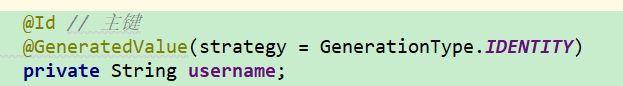
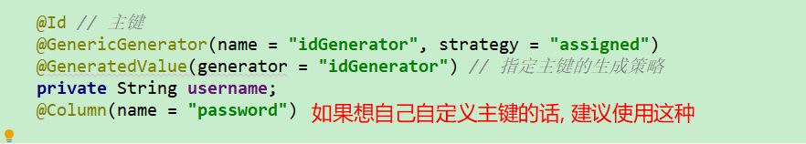

# 如何指定SpringDataJpa 中的实体类的主键生成类型

## 1. JPA 自带的主键生成策略

- **TABLE**： 使用一个特定的数据库表格来保存主键
- **SEQUENCE**： 根据底层数据库的序列来生成主键，条件是数据库支持序列。这个值要与generator一起使用，generator 指定生成主键使用的生成器（可能是orcale中自己编写的序列）
- **IDENTITY**： 主键由数据库自动生成（主要是支持自动增长的数据库，如mysql）
- **AUTO**： 主键由程序控制，也是GenerationType的默认值

### 使用建议



## 2. 使用Hibernate的主键生成策略

### 一、主键类型

#### 1.自然主键（主键本身就是表中的一个字段，实体中一个具体的属性）

表中已经具有某字段，并且该字段具有业务含义作为主键，称之为自然主键。

例如：在person表中的身份证号，既是唯一的，又可以单独标识一个person

又如：在customer表中，如果把name作为主键，其前提条件必须是，每一个客户的姓名不允许为null，不允许客户重名，并且不允许修改客户姓名。尽管这也是可行的，但是不能满足不断变化的业务需求，一旦出现了允许客户重名的业务需求，就必须修改数据模型，重新定义表的主键，这给数据库的维护增加了难度。

#### 2.代理主键（主键不是实体中某个具体的属性，而是一个不相关的字段）

表中不具备业务含义的字段作为主键，称之为代理主键。更合理的方式是使用代理主键。

### 二、主键生成策略

主键生成策略，就是每条记录录入时，主键的生成规则。Hibernate中，提供了几个内置的主键生成策略，其常用主键生成策略的名称和描述如下

#### 1.代理主键

##### identity（主键自增）

适用于long、short或int类型主键，采用底层数据库本身提供的主键生成标识符。在DB2、MySQL、MS SQL Server、Sybase和HypersonicSQL数据库中可以使用该生成器，该生成器要求在数据库中把主键定义成为自增类型。Oracle没有自动增长

##### sequence（序列）

适用于long、short或int类型主键，Hibernate根据底层数据库序列生成标识符。条件是数据库支持序列。如oralce、DB、SAP DB、PostgerSQL、McKoi中的sequence，MySQL这种不支持sequence

##### increment（主键自增，单线程，maxID+1）

适用于long、short或int类型主键，由Hibernate提供自动递增的方式生成唯一标识符，每次增量为1。只有当没有其他进程向同一张表中插入数据时才可以使用，不能再多线程环境下使用

##### hilo（主键自增，高低位算法）

hilo（高低位方式high low）是hibernate中最常用的一种生成方式，需要一张额外的表保存hi的值。保存hi值的表至少有一条记录（只与第一条记录有关），否则会出现错误。跨数据库，hilo算法生成的标志只能在一个数据库中保证唯一

##### native（hilo+identity+sequence三选一）

根据底层数据库对自动生成标识符的能力来选择identity、sequence、hilo三种生成器中的一种，适合跨数据库平台开发

##### uuid（随机字符串作主键）

Hibernate采用128位的UUID算法来生成标识符。该算法能够在网络环境中生成唯一的字符串标识符，其UUID被编码为一个长度为32位的十六进制字符串。按照开放软件基金会(OSF)制定的标准计算，用到了以太网卡地址、纳秒级时间、芯片ID码和许多可能的数字

uuid长度大，占用空间大，跨数据库，不用访问数据库就生成主键值，==所以效率高且能保证唯一性，移植非常方便，推荐使用==。

##### guid（全球唯一标识符）

全球唯一标识符，也称作 UUID，是一个128位长的数字，用16进制表示。算法的核心思想是结合机器的网卡、当地时间、一个随即数来生成GUID。

Hibernate在维护主键时，先查询数据库，获得一个uuid字符串，该字符串就是主键值，该值唯一，缺点长度较大，支持数据库有限，优点同uuid，跨数据库，但是仍然需要访问数据库。注意：长度因数据库不同而不同。

需要数据库支持查询uuid，生成时需要查询数据库，效率没有uuid高，推荐使用uuid。

#### 2.自然主键(自己设置的主键)

##### ==assigned==（用户手动录入）

由Java程序负责生成标识符，Hibernate不管理主键，用户手动设置主键的值。如果不指定id元素的generator属性，则默认使用该主键生成策略

### 使用建议



```java
package com.changgou.pojo;

import com.fasterxml.jackson.annotation.JsonIgnoreProperties;
import org.hibernate.annotations.GenericGenerator;

import javax.persistence.*;
import java.io.Serializable;

/**
 * @program: other
 * @classname: com.changgou.pojo.User
 * @description:
 * @author: liu yang fang
 * @date: 2019-09-01 09:02
 * @version: v1.0
 **/
@Table(name = "user") // 指定映射表
@Entity // 指定为一个实体对象
@JsonIgnoreProperties(value = { "hibernateLazyInitializer", "handler" })
public class User  implements Serializable {
    @Id // 主键
    
    @GenericGenerator(name = "idGenerator", strategy = "assigned")
    @GeneratedValue(generator = "idGenerator") // 指定主键的生成策略
    // TABLE: 使用一个特定的数据库表来保存主键
    // SEQUENCE: 根据底层数据库的序列来生成主键, 条件是数据库支持序列
    // IDENTITY: 主键自增
    // AUTO: 主键由程序控制
    private String username;
    @Column(name = "password")
    private String password;


    public User() {
    }

    public User(String username, String password) {
        this.username = username;
        this.password = password;
    }

    public String getUsername() {
        return username;
    }

    public void setUsername(String username) {
        this.username = username;
    }

    public String getPassword() {
        return password;
    }

    public void setPassword(String password) {
        this.password = password;
    }
}

```

# springboot集成JPA返回Json报错 com.fasterxml.jackson.data

## 解决方案:

```java
@JsonIgnoreProperties(value = { "hibernateLazyInitializer", "handler" })
```

## 异常信息记录

```java
com.fasterxml.jackson.databind.exc.InvalidDefinitionException: No serializer found for class org.hibernate.proxy.pojo.bytebuddy.ByteBuddyInterceptor and no properties discovered to create BeanSerializer (to avoid exception, disable SerializationFeature.FAIL_ON_EMPTY_BEANS) (through reference chain: com.litchi.springboot.oem.pojo.TestUser$HibernateProxy$WQfKicqu["hibernateLazyInitializer"])
    at com.fasterxml.jackson.databind.exc.InvalidDefinitionException.from(InvalidDefinitionException.java:77) ~[jackson-databind-2.9.7.jar:2.9.7]
    at com.fasterxml.jackson.databind.SerializerProvider.reportBadDefinition(SerializerProvider.java:1191) ~[jackson-databind-2.9.7.jar:2.9.7]
    at com.fasterxml.jackson.databind.DatabindContext.reportBadDefinition(DatabindContext.java:313) ~[jackson-databind-2.9.7.jar:2.9.7]
    at com.fasterxml.jackson.databind.ser.impl.UnknownSerializer.failForEmpty(UnknownSerializer.java:71) ~[jackson-databind-2.9.7.jar:2.9.7]
    at com.fasterxml.jackson.databind.ser.impl.UnknownSerializer.serialize(UnknownSerializer.java:33) ~[jackson-databind-2.9.7.jar:2.9.7]
    at com.fasterxml.jackson.databind.ser.BeanPropertyWriter.serializeAsField(BeanPropertyWriter.java:727) ~[jackson-databind-2.9.7.jar:2.9.7]
    at com.fasterxml.jackson.databind.ser.std.BeanSerializerBase.serializeFields(BeanSerializerBase.java:719) ~[jackson-databind-2.9.7.jar:2.9.7]
    at com.fasterxml.jackson.databind.ser.BeanSerializer.serialize(BeanSerializer.java:155) ~[jackson-databind-2.9.7.jar:2.9.7]
    at com.fasterxml.jackson.databind.ser.DefaultSerializerProvider._serialize(DefaultSerializerProvider.java:480) ~[jackson-databind-2.9.7.jar:2.9.7]
    at com.fasterxml.jackson.databind.ser.DefaultSerializerProvider.serializeValue(DefaultSerializerProvider.java:319) ~[jackson-databind-2.9.7.jar:2.9.7]
    at com.fasterxml.jackson.databind.ObjectWriter$Prefetch.serialize(ObjectWriter.java:1396) ~[jackson-databind-2.9.7.jar:2.9.7]
    at com.fasterxml.jackson.databind.ObjectWriter.writeValue(ObjectWriter.java:913) ~[jackson-databind-2.9.7.jar:2.9.7]
    at org.springframework.http.converter.json.AbstractJackson2HttpMessageConverter.writeInternal(AbstractJackson2HttpMessageConverter.java:287) ~[spring-web-5.1.2.RELEASE.jar:5.1.2.RELEASE]
    at org.springframework.http.converter.AbstractGenericHttpMessageConverter.write(AbstractGenericHttpMessageConverter.java:103) ~[spring-web-5.1.2.RELEASE.jar:5.1.2.RELEASE]
    at org.springframework.web.servlet.mvc.method.annotation.AbstractMessageConverterMethodProcessor.writeWithMessageConverters(AbstractMessageConverterMethodProcessor.java:289) ~[spring-webmvc-5.1.2.RELEASE.jar:5.1.2.RELEASE]
    at org.springframework.web.servlet.mvc.method.annotation.RequestResponseBodyMethodProcessor.handleReturnValue(RequestResponseBodyMethodProcessor.java:180) ~[spring-webmvc-5.1.2.RELEASE.jar:5.1.2.RELEASE]
    at org.springframework.web.method.support.HandlerMethodReturnValueHandlerComposite.handleReturnValue(HandlerMethodReturnValueHandlerComposite.java:82) ~[spring-web-5.1.2.RELEASE.jar:5.1.2.RELEASE]
    at org.springframework.web.servlet.mvc.method.annotation.ServletInvocableHandlerMethod.invokeAndHandle(ServletInvocableHandlerMethod.java:119) ~[spring-webmvc-5.1.2.RELEASE.jar:5.1.2.RELEASE]
    at org.springframework.web.servlet.mvc.method.annotation.RequestMappingHandlerAdapter.invokeHandlerMethod(RequestMappingHandlerAdapter.java:895) ~[spring-webmvc-5.1.2.RELEASE.jar:5.1.2.RELEASE]
    at org.springframework.web.servlet.mvc.method.annotation.RequestMappingHandlerAdapter.handleInternal(RequestMappingHandlerAdapter.java:800) ~[spring-webmvc-5.1.2.RELEASE.jar:5.1.2.RELEASE]
    at org.springframework.web.servlet.mvc.method.AbstractHandlerMethodAdapter.handle(AbstractHandlerMethodAdapter.java:87) ~[spring-webmvc-5.1.2.RELEASE.jar:5.1.2.RELEASE]
    at org.springframework.web.servlet.DispatcherServlet.doDispatch(DispatcherServlet.java:1038) ~[spring-webmvc-5.1.2.RELEASE.jar:5.1.2.RELEASE]
    at org.springframework.web.servlet.DispatcherServlet.doService(DispatcherServlet.java:942) ~[spring-webmvc-5.1.2.RELEASE.jar:5.1.2.RELEASE]
    at org.springframework.web.servlet.FrameworkServlet.proce***equest(FrameworkServlet.java:998) ~[spring-webmvc-5.1.2.RELEASE.jar:5.1.2.RELEASE]
    at org.springframework.web.servlet.FrameworkServlet.doGet(FrameworkServlet.java:890) ~[spring-webmvc-5.1.2.RELEASE.jar:5.1.2.RELEASE]
    at javax.servlet.http.HttpServlet.service(HttpServlet.java:634) ~[tomcat-embed-core-9.0.12.jar:9.0.12]
    at org.springframework.web.servlet.FrameworkServlet.service(FrameworkServlet.java:875) ~[spring-webmvc-5.1.2.RELEASE.jar:5.1.2.RELEASE]
    at javax.servlet.http.HttpServlet.service(HttpServlet.java:741) ~[tomcat-embed-core-9.0.12.jar:9.0.12]
    at org.apache.catalina.core.ApplicationFilterChain.internalDoFilter(ApplicationFilterChain.java:231) ~[tomcat-embed-core-9.0.12.jar:9.0.12]
    at org.apache.catalina.core.ApplicationFilterChain.doFilter(ApplicationFilterChain.java:166) ~[tomcat-embed-core-9.0.12.jar:9.0.12]
    at org.apache.tomcat.websocket.server.WsFilter.doFilter(WsFilter.java:53) ~[tomcat-embed-websocket-9.0.12.jar:9.0.12]
    at org.apache.catalina.core.ApplicationFilterChain.internalDoFilter(ApplicationFilterChain.java:193) ~[tomcat-embed-core-9.0.12.jar:9.0.12]
    at org.apache.catalina.core.ApplicationFilterChain.doFilter(ApplicationFilterChain.java:166) ~[tomcat-embed-core-9.0.12.jar:9.0.12]
    at org.springframework.web.filter.RequestContextFilter.doFilterInternal(RequestContextFilter.java:99) ~[spring-web-5.1.2.RELEASE.jar:5.1.2.RELEASE]
    at org.springframework.web.filter.OncePerRequestFilter.doFilter(OncePerRequestFilter.java:107) ~[spring-web-5.1.2.RELEASE.jar:5.1.2.RELEASE]
    at org.apache.catalina.core.ApplicationFilterChain.internalDoFilter(ApplicationFilterChain.java:193) ~[tomcat-embed-core-9.0.12.jar:9.0.12]
    at org.apache.catalina.core.ApplicationFilterChain.doFilter(ApplicationFilterChain.java:166) ~[tomcat-embed-core-9.0.12.jar:9.0.12]
    at org.springframework.web.filter.FormContentFilter.doFilterInternal(FormContentFilter.java:92) ~[spring-web-5.1.2.RELEASE.jar:5.1.2.RELEASE]
    at org.springframework.web.filter.OncePerRequestFilter.doFilter(OncePerRequestFilter.java:107) ~[spring-web-5.1.2.RELEASE.jar:5.1.2.RELEASE]
    at org.apache.catalina.core.ApplicationFilterChain.internalDoFilter(ApplicationFilterChain.java:193) ~[tomcat-embed-core-9.0.12.jar:9.0.12]
    at org.apache.catalina.core.ApplicationFilterChain.doFilter(ApplicationFilterChain.java:166) ~[tomcat-embed-core-9.0.12.jar:9.0.12]
    at org.springframework.web.filter.HiddenHttpMethodFilter.doFilterInternal(HiddenHttpMethodFilter.java:93) ~[spring-web-5.1.2.RELEASE.jar:5.1.2.RELEASE]
    at org.springframework.web.filter.OncePerRequestFilter.doFilter(OncePerRequestFilter.java:107) ~[spring-web-5.1.2.RELEASE.jar:5.1.2.RELEASE]
    at org.apache.catalina.core.ApplicationFilterChain.internalDoFilter(ApplicationFilterChain.java:193) ~[tomcat-embed-core-9.0.12.jar:9.0.12]
    at org.apache.catalina.core.ApplicationFilterChain.doFilter(ApplicationFilterChain.java:166) ~[tomcat-embed-core-9.0.12.jar:9.0.12]
    at org.springframework.web.filter.CharacterEncodingFilter.doFilterInternal(CharacterEncodingFilter.java:200) ~[spring-web-5.1.2.RELEASE.jar:5.1.2.RELEASE]
    at org.springframework.web.filter.OncePerRequestFilter.doFilter(OncePerRequestFilter.java:107) ~[spring-web-5.1.2.RELEASE.jar:5.1.2.RELEASE]
    at org.apache.catalina.core.ApplicationFilterChain.internalDoFilter(ApplicationFilterChain.java:193) ~[tomcat-embed-core-9.0.12.jar:9.0.12]
    at org.apache.catalina.core.ApplicationFilterChain.doFilter(ApplicationFilterChain.java:166) ~[tomcat-embed-core-9.0.12.jar:9.0.12]
    at org.apache.catalina.core.StandardWrapperValve.invoke(StandardWrapperValve.java:199) ~[tomcat-embed-core-9.0.12.jar:9.0.12]
    at org.apache.catalina.core.StandardContextValve.invoke(StandardContextValve.java:96) [tomcat-embed-core-9.0.12.jar:9.0.12]
    at org.apache.catalina.authenticator.AuthenticatorBase.invoke(AuthenticatorBase.java:490) [tomcat-embed-core-9.0.12.jar:9.0.12]
    at org.apache.catalina.core.StandardHostValve.invoke(StandardHostValve.java:139) [tomcat-embed-core-9.0.12.jar:9.0.12]
    at org.apache.catalina.valves.ErrorReportValve.invoke(ErrorReportValve.java:92) [tomcat-embed-core-9.0.12.jar:9.0.12]
    at org.apache.catalina.core.StandardEngineValve.invoke(StandardEngineValve.java:74) [tomcat-embed-core-9.0.12.jar:9.0.12]
    at org.apache.catalina.connector.CoyoteAdapter.service(CoyoteAdapter.java:343) [tomcat-embed-core-9.0.12.jar:9.0.12]
    at org.apache.coyote.http11.Http11Processor.service(Http11Processor.java:408) [tomcat-embed-core-9.0.12.jar:9.0.12]
    at org.apache.coyote.AbstractProcessorLight.process(AbstractProcessorLight.java:66) [tomcat-embed-core-9.0.12.jar:9.0.12]
    at org.apache.coyote.AbstractProtocol$ConnectionHandler.process(AbstractProtocol.java:770) [tomcat-embed-core-9.0.12.jar:9.0.12]
    at org.apache.tomcat.util.net.NioEndpoint$SocketProcessor.doRun(NioEndpoint.java:1415) [tomcat-embed-core-9.0.12.jar:9.0.12]
    at org.apache.tomcat.util.net.SocketProcessorBase.run(SocketProcessorBase.java:49) [tomcat-embed-core-9.0.12.jar:9.0.12]
    at java.util.concurrent.ThreadPoolExecutor.runWorker(ThreadPoolExecutor.java:1142) [na:1.8.0_112]
    at java.util.concurrent.ThreadPoolExecutor$Worker.run(ThreadPoolExecutor.java:617) [na:1.8.0_112]
    at org.apache.tomcat.util.threads.TaskThread$WrappingRunnable.run(TaskThread.java:61) [tomcat-embed-core-9.0.12.jar:9.0.12]
    at java.lang.Thread.run(Thread.java:745) [na:1.8.0_112]
```

