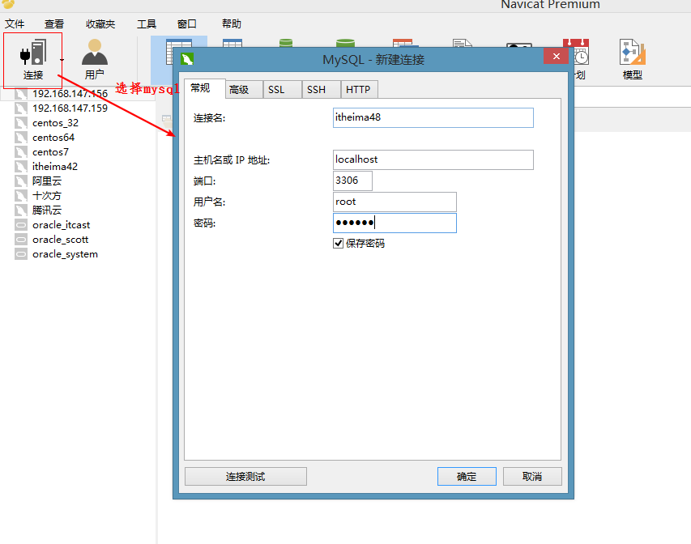
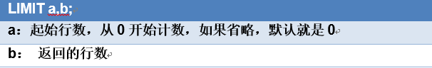
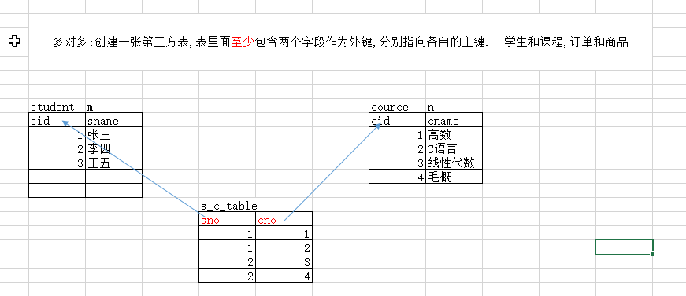
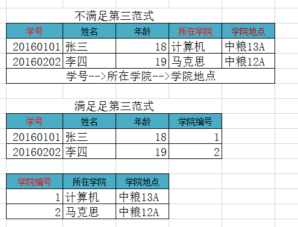

# day15-MySQL进阶

# 学习目标

1. 能够使用SQL语句进行排序
2. 能够使用聚合函数
3. 能够使用SQL语句进行分组查询
4. 能够完成数据的备份和恢复
5. 能够说出多表之间的关系及其建表原则
6. 能够理解三大范式 

# 第一章-可视化软件介绍 

## 实操-Navicat的使用

### 1.目标

+ 掌握视化软件Navicat的使用

### 2.讲解

- 连接数据库

  


- 对数据库的操作

  


- 对表的操作
- 对数据的操作


### 3.小结

# 第二章-查询记录【重点】

+ 环境准备

```sql
# 创建学生表(有sid,学生姓名,学生性别,学生年龄,分数列,其中sid为主键自动增长)
CREATE TABLE student(
	sid INT PRIMARY KEY auto_increment,
	sname VARCHAR(40),
	sex VARCHAR(10),
	age INT,
  score DOUBLE
);

INSERT INTO student VALUES(null,'zs','男',18,98.5);
INSERT INTO student VALUES(null,'ls','女',18,96.5);
INSERT INTO student VALUES(null,'ww','男',15,50.5);
INSERT INTO student VALUES(null,'zl','女',20,98.5);
INSERT INTO student VALUES(null,'tq','男',18,60.5);
INSERT INTO student VALUES(null,'wb','男',38,98.5);
INSERT INTO student VALUES(null,'小丽','男',18,100);
INSERT INTO student VALUES(null,'小红','女',28,28);
INSERT INTO student VALUES(null,'小强','男',21,95);
```

## 知识点-排序查询

### 1.目标

+ 能够使用SQL语句进行排序

### 2.讲解

#### 2.1单列排序

+ 只按某一个字段进行排序，单列排序

```
SELECT 字段名 FROM 表名 [WHERE 条件] ORDER BY 字段名 [ASC|DESC];  //ASC: 升序，默认值; DESC: 降序
```

+ 以分数降序查询所有的学生

```
select * from student order by score desc;
```

#### 2.2组合排序

+ 同时对多个字段进行排序，如果第1个字段相等，则按第2个字段排序，依次类推

```
SELECT 字段名 FROM 表名 WHERE 字段=值 ORDER BY 字段名1 [ASC|DESC], 字段名2 [ASC|DESC];
```

+ 以分数降序查询所有的学生, 如果分数一致,再以age降序

```
select * from student order by score desc, age desc;
```

#### 2.3应用场景

+ 商城项目里面以价格, 销量排序
+ 社交项目里面以距离排序
+ 一般项目里面有订单的话, 以下单时间 排序

### 3.结论

### 2.聚合函数   

#### 2.1概述

​	之前我们做的查询都是横向查询，它们都是根据条件一行一行的进行判断，而使用聚合函数查询是纵向查询，它是对一列的值进行计算，然后返回一个结果值。聚合函数会忽略空值NULL

| 聚合函数          | 作用          |
| ------------- | ----------- |
| max(列名)       | 求这一列的最大值    |
| min(列名)       | 求这一列的最小值    |
| avg(列名)       | 求这一列的平均值    |
| **count(列名)** | 统计这一列有多少条记录 |
| sum(列名)       | 对这一列求总和     |

#### 2.2语法

- 语法

```sql
SELECT 聚合函数(列名) FROM 表名 [where 条件];
```

- 练习

```sql
-- 求出学生表里面的最高分数
SELECT MAX(score) FROM student;
-- 求出学生里面最小的age
SELECT MIN(age) FROM student;
-- 求出学生表里面的分数的总和(忽略null值)
SELECT SUM(IFNULL(score,0)) FROM student;
-- 求出学生表里面的平均分
SELECT AVG(score) FROM student;
-- 统计学生的总人数 (忽略null)  
SELECT COUNT(sid) FROM student; 
SELECT COUNT(*) FROM student;
```

- 聚合函数会忽略空值NULL

  ​	我们发现对于NULL的记录不会统计，建议如果统计个数则不要使用有可能为null的列，但如果需要把NULL也统计进去呢？我们可以通过 IFNULL(列名，默认值) 函数来解决这个问题. 如果列不为空，返回这列的值。如果为NULL，则返回默认值。 eg: select sum==(ifnull(chinese,0)==) from student;

  ​	                 

### 3.分组   

#### 3.1概述

​	 分组查询是指使用 GROUP BY语句对查询信息进行分组

​	 GROUP BY怎么分组的？ 将分组字段结果中相同内容作为一组，如按性别将学生分成两组

​	 GROUP BY将分组字段结果中相同内容作为一组，并且返回每组的第一条数据，所以单独分组没什么用处。分组的目的就是为了统计，一般分组会跟聚合函数一起使用

​	1.单独分组没什么用处,每组的第一条数据展示了

​	2.有几组就有几条记录

#### 3.2语法

```
SELECT 字段1,字段2... FROM 表名  [where 条件] GROUP BY 列 [HAVING 条件];
```

+ 练习:根据性别分组, 统计每一组学生的总人数

```
select sex, count(*) from student group by sex;
```

#### 3.3 分组后筛选 having

+ 练习根据性别分组, 统计每一组学生的总人数> 5的(分组后筛选)

```
select  sex, count(*) from  student   group by sex having  count(*) > 5
```

+ where和having区别【面试】


+ 面试题

  

  Orders表数据如下所示，执行如下SQL语句，运行结果是？

  ```
  select product,sum(price)  from orders group by product where sum(price) > 30;  
  //错误 1.where在group之前 2.where后面不可以使用聚合函数
  ```

### 4.分页查询 limit   

#### 4.1概述

​	LIMIT是限制的意思，所以LIMIT的作用就是限制查询记录的条数. 经常用来做分页查询

#### 4.2 语法

```
select ... from .... limit a ,b.
```




+ b: 一页显示的数量(我们根据需求自己定义的)  
+ a: 从哪里开始查询(从0开始计数) ;  

```sql
-- 分页查询学生, 一页显示3条  b = 3; 
-- a = (当前页码-1)*b;
-- 第一页  a =0, b = 3 
SELECT * from student limit 0,3;
-- 第二页 a = 3 ,b = 3;
SELECT * from student limit 3,3;
-- 第三页 a = 6 ,b = 3;
SELECT * from student limit 6,3;
```

### 5.查询的语法

+ 书写顺序

```
select ... from...where...group...having...order...limit
```

+ 执行顺序

```
from...where...group....having...select...order...limit
```

## 三,多表间的关系【重点】

### 1. 为什么要拆表?

​	准备工作:

​			创建一张分类表(类别id,类别名称.备注:类别id为主键并且自动增长)

​			创建一张商品表(商品id,商品名称,商品价格,商品数量,类别.备注:商品id为主键并且自动增长)

```
-- 创建一张分类表(类别id,类别名称.备注:类别id为主键并且自动增长)
CREATE TABLE t_category(
	cid INT PRIMARY KEY auto_increment,
	cname varchar(20)
);

INSERT INTO t_category values(null,'手机数码');
INSERT INTO t_category values(null,'食物');


-- 创建一张商品表(商品id,商品名称,商品价格,商品数量,类别编号.备注:商品id为主键并且自动增长)
CREATE TABLE t_product(
	pid INT PRIMARY KEY auto_increment,
	pname varchar(40),
	price DOUBLE,
	num INT,
	cno INT
);

INSERT INTO t_product values(null,'Mac',18000,10,1);
INSERT INTO t_product values(null,'iPhonex',6000,100,1);
INSERT INTO t_product values(null,'iPhone6s',5000,10,1);
INSERT INTO t_product values(null,'iPhone5s',4000,10,1);
INSERT INTO t_product values(null,'iPhone5',3000,20,1);
INSERT INTO t_product values(null,'iPhone4s',2000,20,1);

INSERT INTO t_product values(null,'方便面',4.5,1000,2);
INSERT INTO t_product values(null,'矿泉水',3.5,100,2);
INSERT INTO t_product values(null,'咖啡',10,3000,2);


```

​	有些情况下,使用一张表表示数据 数据不好维护, 存在数据冗余现象

### 2.引用完整性【重点】

​	表和表之间存在一种关系，但是这个关系需要谁来维护和约束？

#### 2.1外键约束

​	保证引用完整性. 表和表之间存在一种关系，但是这个关系是通过外键来维护和约束的

#### 2.2外键的使用


+ 添加外键语法

```
alter table 表 add [CONSTRAINT] [外键名称] foreign key(字段) references 表（字段);

alter table 表 add  foreign key(列) references 表（列);
-- 给商品表添加外键
alter table t_product add foreign key(cno) references t_category(cid);
```

+ 删除外键语法

```
ALTER TABLE 表 drop foreign key 外键名称;
```


**注意:**

​	外键列的类型一定要和参照列(主键)的类型一致

​	有主键才能有外键, 参照的列(主键)必须为主键  

+ 外键练习

```
//学生表
CREATE TABLE student(
	sid int primary key,
	name varchar(50) not null,
	sex varchar(10)
);
	
//分数表
create table score( 
	id int primary key,
	score int,
	sid1 varchar(20) 
);


添加外键方式:
	ALTER TABLE score ADD  FOREIGN KEY(sid1) REFERENCES student(sid);  //错误的, sid1是字符串类型, 引用的sid是int类型
```

#### 2.3外键的级联  

删除一方的时候另外的一方的数据没有任何用途的时候才可以使用 eg: 公司和员工

+ 要把类别的id值1，改成5，能不能直接修改呢？

```sql
UPDATE categoey SET cid=5 WHERE cid=2;
```

​	不能直接修改:Cannot delete or update a parent row: a foreign key constraint fails 如果副表(商品表)中有引用的数据,不能直接修改主表(类别表)主键

+ 要删除类别为1的类别,能不能直接删除呢？

```sql
DELETE FROM categoey WHERE id = 1;
```

​	不能直接删除:Cannot delete or update a parent row: a foreign key constraint fails 如果副表(商品表)中有引用的数据,不能直接删除主表(类别表)数据

+ 什么是级联操作

  在修改和删除主表的主键时，同时更新或删除副表的外键值，称为级联操作
  `ON UPDATE CASCADE` -- 级联更新，主键发生更新时，外键也会更新
  `ON DELETE CASCADE` -- 级联删除，主键发生删除时，外键也会删除

具体操作：

- 删除product表
- 重新创建product表，添加级联更新和级联删除

```sql
ALTER TABLE product ADD FOREIGN KEY(cno) REFERENCES category(cid) ON UPDATE CASCADE ON DELETE CASCADE
```


### 3.多表的关系  

#### 3.1 一对多【重点】 

- 在多方创建一个字段作为外键，指向一方主键


```
alter table product add foreign key(cid) references  category(cid)
```


#### 3.2 多对多【重点】      

- 新建一张中间表，**至少**包含两个字段，都作为外键，分别指向各自的主键




```
alter table s_c_table add foreign key(sno) references student(sid);
alter table s_c_table add foreign key(cno) references cource(cid);
```

#### 3.3一对一【了解】

- 先当做一对多，在外键字段添加唯一约束。


#### 3.4 扩展_旅游项目里面表关系分析


## 四,数据的备份和还原  【会用】

### 1.备份的应用场景

​	在服务器进行数据传输、数据存储和数据交换，就有可能产生数据故障。比如发生意外停机或存储介质损坏。这时，如果没有采取数据备份和数据恢复手段与措施，就会导致数据的丢失，造成的损失是无法弥补与估量的。

### 2.使用navicat备份和还原

## 五,数据库设计三大范式  【面试】   

### 1.概述 

​	好的数据库设计对数据的存储性能和后期的程序开发，都会产生重要的影响。建立科学的，规范的数据库就需要满足一些规则来优化数据的设计和存储，这些规则就称为范式。 

### 2.三大范式

#### 2.1 1NF

##### 2.1.1概述

​	数据库表的每一列都是不可分割的原子数据项，不能是集合、数组等非原子数据项。即表中的某个列有多个值时，必须拆分为不同的列。简而言之，第一范式每一列不可再拆分，称为原子性

##### 2.1.2 应用


##### 2.1.3 总结

​	如果不遵守第一范式，查询出数据还需要进一步处理（查询不方便）。遵守第一范式，需要什么字段的数据就查询什么数据（方便查询）

#### 2.2 2NF

##### 2.2.2概述

​	在满足第一范式的前提下，表中的每一个字段都完全依赖于主键。所谓完全依赖是指不能存在仅依赖主键一部分的列。简而言之，第二范式就是在第一范式的基础上所有列完全依赖于主键列。当存在一个复合主键包含多个主键列的时候，才会发生不符合第二范式的情况。比如有一个主键有两个列，不能存在这样的属性，它只依赖于其中一个列，这就是不符合第二范式。

简而言之,第二范式需要满足:

1. 一张表只描述一件事情
2. 表中的每一个列都依赖于主键

##### 2.2.2 应用


##### 2.3.3总结

​	如果不准守第二范式，数据冗余，相同数据无法区分。遵守第二范式减少数据冗余，通过主键区分相同数据。

#### 2.3  3NF

##### 2.2.3概述

​	在满足第二范式的前提下，表中的每一列都直接依赖于主键，而不是通过其它的列来间接依赖于主键。简而言之，第三范式就是所有列不依赖于其它非主键列，也就是在满足2NF的基础上，任何非主列不得传递依赖于主键。所谓传递依赖，指的是如果存在"A → B → C"的决定关系，则C传递依赖于A。因此，满足第三范式的数据库表应该不存在如下依赖关系：主键列 → 非主键列x → 非主键列y

##### 2.2.4应用



##### 2.2.5总结

​	如果不准守第三范式，可能会有相同数据无法区分，修改数据的时候多张表都需要修改（不方便修改）。遵守第三范式通过id可以区分相同数据，修改数据的时候只需要修改一张表（方便修改）。

### 3.总结


