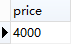
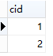
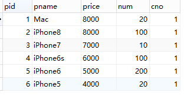
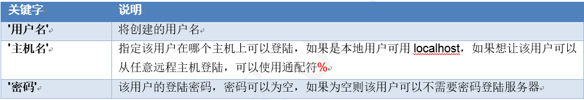
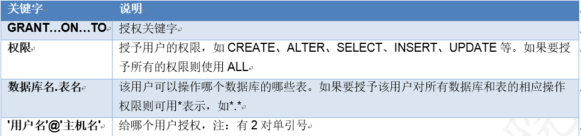
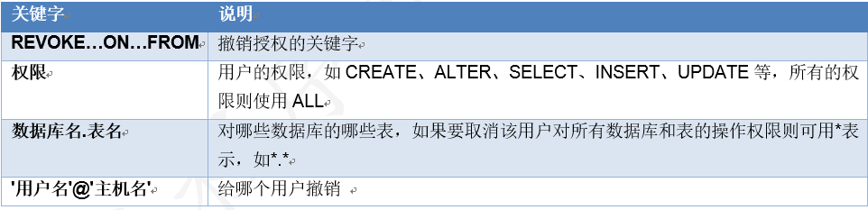

# day16-MySQL多表

## 学习目标

1. 能够使用内连接进行多表查询
2. 能够使用左外连接和右外连接进行多表查询
3. 能够使用子查询进行多表查询
4. 能够理解事务的概念
5. 能够说出事务的原理
6. 能够在MySQL中使用事务
7. 能够使用DCL处理MySQL中的用户  

## 一,连接查询

### 1.交叉查询【了解】

若干表没有条件的连接在一起

```
select a.*,b.* from a,b ;  
或者 select *from a,b ;
```

**注:**

- 交叉查询其实是一种错误.数据大部分是无用数据,叫笛卡尔积.
- 假设集合A={a,b}，集合B={0,1,2}，则两个集合的笛卡尔积为{(a,0),(a,1),(a,2),(b,0),(b,1),(b,2)}。可以扩展到多个集合的情况。

练习: 使用交叉查询类别和商品

```mysql
select * from t_category, t_product;
```

### 2.内连接查询【重点】

​	交叉查询产生这样的结果并不是我们想要的，那么怎么去除错误的，不想要的记录呢，当然是通过条件过滤。通常要查询的多个表之间都存在关联关系，那么就通过关联关系去除笛卡尔积。

#### 2.1 隐式内连接

```
select [字段,字段,字段][*] from a,b where 连接条件 (a表里面的主键 = b表里面的外键) 
```

#### 2.2 显示内连接

```
select [字段,字段,字段][*] from a [inner] join b on 连接条件 [ where 其它条件]
```

**注:**

+ 内连接查询的是公共部分(就是满足连接条件的部分,主外键关系 )

- 使用主外键关系做为条件来去除无用信息.  抓住主外键的关系,用主外键作为连接条件  b表里面的外键 = a表里面的主键
- 显示连接里面的,on只能用主外键关联作为条件,如果还有其它条件,后面加where

练习:查询所有类别下的商品信息,如果该类别下没有商品则不展示.

```mysql
-- 2.1 隐式内连接方式 
select *from t_category  c, t_product  p WHERE c.cid = p.cno;
-- 2.2 显示内连接方式  
SELECT * from t_category c INNER JOIN t_product p ON c.cid = p.cno
```

### 3.外连接【重点】

#### 3.1左外连接

​	以join左边的表为主表,展示主表(左边表)的所有数据,根据条件查询连接右边表的数据,若满足条件则展示,若不满足则以null显示

​	可以理解为：在内连接的基础上保证左边表的数据全部显示

```
select 字段 from a left [outer] join b on 条件
```

练习:查询所有类别下的商品信息

```mysql
SELECT * FROM t_category c LEFT OUTER JOIN t_product p ON c.cid = p.cno
```

#### 3.2右外连接

​	以join右边的表为主表,展示它的所有数据,根据条件查询join左边表的数据,若满足则展示,若不满足则以null显示

​	可以理解为：在内连接的基础上保证右边表的数据全部显示

```
select 字段 from a right [outer] join b on 条件
```

练习:查询所有商品所对应的类别信息

```mysql
SELECT * FROM t_category c RIGHT  OUTER JOIN t_product p ON c.cid = p.cno
```

## 二,子查询

### 1,子查询概述

#### 1.1什么是子查询  

直观一点: 一个查询里面至少包含2个select

+   一个查询的结果做为另一个查询的条件
+   有查询的嵌套，内部的查询称为子查询
+   子查询要使用括号

#### 1.2子查询初体验

eg:查询价格高于IPhone5的商品信息

- 第一步:查询Iphone5s的商品价格

```
SELECT price FROM t_product where pname = 'iPhone5s';
```

+ 第二步:查询价格高iPhone5s的商品信息

```
SELECT * FROM t_product WHERE price > (第一步语句作为条件)
```

### 2. 子查询类别【重点】

#### 2.1子查询的结果是一个值的情况



1. 子查询结果只要是单行单列，肯定在WHERE后面作为条件，父查询使用：比较运算符，如：> 、<、<>、= 等

```
SELECT 查询字段 FROM 表 WHERE 字段=（子查询）;
```

2. 练习

   查询类别是手机数码的所有商品信息

```
 select *from product where cno =  (SELECT cid FROM category where cname ='手机数码');
```

​	查询和方便面是同一类别的商品信息,但是不包括方便面

```
 SELECT *from product where cno = (SELECT cno from Product where pname ='方便面') and pname <> '方便面';
```

#### 2.2子查询的结果是单列多行的情况  



1. 子查询结果是单例多行，结果集类似于一个数组，父查询使用IN运算符

```
SELECT 查询字段 FROM 表 WHERE 字段 IN （子查询）;
```

2. 练习

   查询类别属于手机数码和食物的商品信息

```
SELECT * FROM t_product WHERE cno in (SELECT cid FROM t_category WHERE cname in('手机数码','食物'));
```

​	

#### 2.3子查询的结果是多行多列的情况



1. 子查询结果只要是多列，肯定在FROM后面作为表; 子查询作为表需要取别名，否则这张表没有名称则无法访问表中的字段

```
SELECT 查询字段 FROM （子查询） 表别名 WHERE 条件;
```

2. 练习

   查询所属类别编号(cno)是1的商品里面的最高价格

```
SELECT MAX(c1.price) from (SELECT * FROM product where cno = 1) as c1
```

## 三,事务

### 1.事务的概述

+ 环境的准备

```
//account:账户表
create table account(
    id int primary key auto_increment,
    name varchar(20),
    money double
);

insert into account values (null,'zs',1000);
insert into account values (null,'ls',1000);
insert into account values (null,'ww',1000);
```

#### 1.1什么是事务 

+ 事务指逻辑上的一组操作，组成这组操作的单元要么全部成功，要么全部失败。

  eg: zs给ls转100, 说白了数据库的操作 zs的钱减少100, ls的钱增加100

  操作: 转账

  单元: 钱减少, 钱增加

#### 1.2.事务的作用

​	保证一组操作全部成功或者失败。   

### 2.MYSQL进行事务管理

#### 2.1自动事务(mysql默认)

​	一条sql语句就是一个事务(自动生效了) 

​	针对: 写的操作(insert, update, delete)

#### 2.2手动开启一个事务 

+ 方式一: 手动开启事务的方式    【掌握】

  ​	start transaction;开始事务

  ​	commit；提交

  ​	rollback；回滚

```
eg:
start transaction;  --开始事务
操作数据库(语句都在事务里面受控制了)
rollback；回滚 || commit；提交
```

> 注意: 不管是提交还是回滚, 当前事务都会被结束掉. 不可能提交之后再回滚. 提交和回滚是二选1的

+ 方式二: 设置MYSQL中的自动提交的参数【了解】

  查看MYSQL中事务是否自动提交

  ```
  show variables like '%commit%';
  ```

  设置自动提交的参数为OFF

  ```
  set autocommit = 0;-- 0:OFF  1:ON
  ```

#### 2.3事务原理【了解】

​	事务开启之后, 所有的操作都会临时保存到事务日志中, 事务日志只有在得到commit命令才会同步到数据表中，其他任何情况都会清空事务日志(rollback，断开连接)   注:日志可以通过  `show global variables like '%log%'` 命令查看.

1)    客户端连接数据库服务器，创建连接时创建此用户临时日志文件

2)    开启事务以后，所有的操作都会先写入到临时日志文件中

3)    所有的查询操作从表中查询，但会经过日志文件加工后才返回

4)    如果事务提交则将日志文件中的数据写到表中，否则清空日志文件。

### 3.回滚点

#### 3.1什么是回滚点

​	在某些成功的操作完成之后，后续的操作有可能成功有可能失败，但是不管成功还是失败，前面操作都已经成功，可以在当前成功的位置设置一个回滚点。可以供后续失败操作返回到该位置，而不是返回所有操作，这个点称之为回滚点。

#### 3.2  回滚点的操作语句


#### 3.3具体操作

1)    将数据还原到1000

2)    开启事务

3)    让张三账号减3次钱 

4)    设置回滚点：savepoint three_times;

5)    让张三账号减4次钱

6)    回到回滚点：rollback to three_times;

+ 总结：设置回滚点可以让我们在失败的时候回到回滚点，而不是回到事务开启的时候。

### 4.事务总结  

#### 4.1事务特性【面试题】

- 原子性（Atomicity）原子性是指事务是一个不可分割的工作单位，事务中的操作要么都发生，要么都不发生。

  eg: zs和ls都是1000, zs给ls转100, 

  ​     要么成功 zs变成900, ls变成1100

  ​     要么失败  zs和ls都是1000


- 一致性（Consistency）事务前后数据的完整性必须保持一致.   


  eg: zs和ls都是1000, zs给ls转100,  转之前一共2000

  ​       要么成功 zs变成900, ls变成1100, 一共还是2000

  ​	要么失败  zs和ls都是1000,  一共还是2000

  ​

- 持久性（Durability）持久性是指一个事务一旦被提交，它对数据库中数据的改变就是永久性的，接下来即使数据库发生故障也不应该对其有任何影响。

  eg: zs和ls都是1000, zs追ls, zs给ls转520.  zs提交了, 也就意味着生效了.

  ​


- 隔离性（Isolation）事务的隔离性是指多个用户并发访问数据库时，一个用户的事务不能被其它用户的事务所干扰，多个并发事务之间数据要相互隔离。 简单来说: 事务之间互不干扰

  ​

  ​


#### 4.2如果不考虑隔离性，会引发下面的问题

​	事务在操作时的理想状态： 所有的事务之间保持隔离，互不影响。因为并发操作，多个用户同时访问同一个数据。可能引发并发访问的问题


#### 4.3事务隔离级别

​	可以通过设置事物隔离级别解决读的问题

##### 4.3.1事务四个隔离级别  

| **级别** | **名字** | **隔离级别**         | **脏读** | **不可重复读** | **幻读** | **数据库默认隔离级别** |
| ------ | ------ | ---------------- | ------ | --------- | ------ | ------------- |
| **1**  | 读未提交   | read uncommitted | 是      | 是         | 是      |               |
| **2**  | 读已提交   | read committed   | 否      | 是         | 是      | Oracle        |
| **3**  | 可重复读   | repeatable read  | 否      | 否         | 是      | MySQL         |
| **4**  | 串行化    | serializable     | 否      | 否         | 否      |               |

> 隔离级别越高，性能越差，安全性越高。

##### 4.3.2设置隔离级别

- 设置事务隔离级别

```
set session transaction isolation level  隔离级别;
```

- 查询当前事务隔离级别

```
select @@tx_isolation;
```

### 5.演示数据库安全性问题的发生

#### 5.1.演示脏读

​	一个事物里面读到了另外一个事物没有提交的数据: read uncommitted

- 1.开启A，B窗口

- 2.分别查询A，B的隔离级别

  ```
  select @@tx_isolation;
  ```

- 3.设置A窗口的隔离级别为read uncommitted(读未提交)

  ```
  set session transaction isolation level read uncommitted;
  ```

- 4.A，B都开始事物

- 5.在B中张三向李四转账100，事物不提交

- 6.在A中查询账户

## 四,创建用户和授权(DCL)【了解】  

### 1.概述

​	我们现在默认使用的都是root用户，超级管理员，拥有全部的权限。但是，一个公司里面的数据库服务器上面可能同时运行着很多个项目的数据库。所以，我们应该可以根据不同的项目建立不同的用户，分配不同的权限来管理和维护数据库。

​	我们刚进公司的时候, 一般是不可能拥有root账户的, 一般都是一些普通用户. 

​	这个章节的知识点都是基于root账户操作的.

### 2.创建用户和删除用户

#### 2.1创建用户

1. 语法

```
CREATE USER '用户名'@'主机名' IDENTIFIED BY '密码';
```



+ 在localhost里面创建zs的普通账户, 密码是123456

```
create user 'zs'@'localhost' IDENTIFIED by '123456';
```

#### 2.2删除用户

+ 用户

```
DROP USER '用户名'@'主机名';
```

+ 把在localhost里面ls删除

```
drop user 'ls'@'localhost';
```

### 3.授权和取消授权

#### 3.1授权

1. 语法

```
GRANT 权限1, 权限2... ON 数据库名.表名 TO '用户名'@'主机名';
```



2. 练习

   给zs用户分配对web16这个数据库操作的权限：创建表，修改表，插入记录，更新记录，查询

```
grant create, alter,select,update on web16.* to 'zs'@'localhost';
```

​	给user2用户分配所有权限，对所有数据库的所有表 

```
grant all on *.* to 'user2'@'%';
```

#### 3.2查看权限

1. 语法

```
SHOW GRANTS FOR '用户名'@'主机名';
```

2. 练习

   查询查看user1用户的权限

```
SHOW GRANTS FOR 'user1'@'主机名';
```

#### 3.3撤销授权

1. 语法 

```
REVOKE  权限1, 权限2... ON 数据库.表名
或者
revoke all on test.* from 'user1'@'localhost'; '用户名'@'主机名';
```



2. 练习

   撤销user1用户对test数据库所有表的操作的权限

```
revoke all on test.* from 'user1'@'localhost';
```

### 4.修改普通用户的密码

1. 语法

```
set password for '用户名'@'主机名' = password('新密码');
```

2. 练习   

将'user1'@'localhost'的密码改成'666666'

```
set password for 'user1'@'localhost' = password('666666');
```
