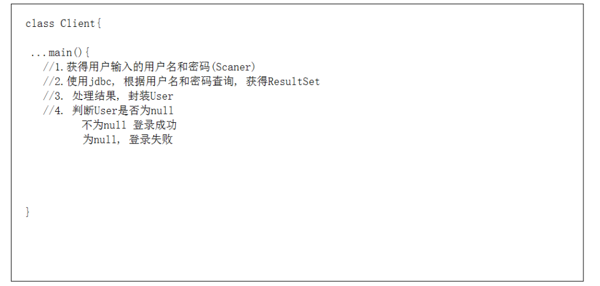

# day17-JDBC

## 学习目标

1. 能够理解JDBC的概念
2. 能够使用DriverManager类
3. 能够使用Connection接口
4. 能够使用Statement接口
5. 能够使用ResultSet接口
6. 能够说出SQL注入原因和解决方案
7. 能够通过PreparedStatement完成增、删、改、查
8. 能够完成PreparedStatement改造登录案例

## 一,JDBC概述 ##

### 1.为什么要使用JDBC ###

1. 没有JDBC


2. 有了JDBC后


### 2.JDBC的概念 ###

#### 2.1什么是JDBC

​	JDBC:java database connectivity:sun公司为了简化和统一java连接数据库,定义的一套规范(API,接口). 

#### 2.2JDBC和数据库驱动的关系

​	接口(JDBC)与实现(驱动jar包)的关系


## 二,开发第一个JDBC程序 ##

### 1.开发第一个JDBC程序

#### 1.1准备工作:

+ 数据库的准备

  ```
  create database web17;

  use web17;

  create table user(
  	id int primary key auto_increment,
  	username varchar(20),
  	password varchar(20),
  	nickname varchar(20)

  );

  INSERT INTO `USER` VALUES(null,'zs','123456','老张');
  INSERT INTO `USER` VALUES(null,'ls','123456','老李');
  INSERT INTO `USER` VALUES(null,'wangwu','123','东方不败');
  ```

+ 驱动jar包导入项目

  + 方式一

  

  + 方式二

  


#### 1.2开发步骤

- 注册驱动(要引入驱动jar包)
- 获得连接
- 创建执行sql语句的对象
- 执行sql语句,处理结果
- 关闭资源

#### 1.3代码实现

```
	public static void main(String[] args) throws SQLException {
		//注册驱动
		DriverManager.registerDriver(new Driver());
		String url = "jdbc:mysql://localhost:3306/day10";
		String user = "root";
		String password = "123456";
		//获得连接
		Connection connection = DriverManager.getConnection(url, user, password);
		//创建执行sql语句对象
		Statement statement = connection.createStatement();
		//执行sql,处理结果
		String sql = "select *from user";
		ResultSet resultSet = statement.executeQuery(sql);
		while (resultSet.next()) {
			System.out.println(resultSet.getObject(1));
			System.out.println(resultSet.getObject(2));
			System.out.println(resultSet.getObject(3));
			System.out.println(resultSet.getObject(4));
			
		}
		//关闭资源
		if(resultSet != null){
			resultSet.close();
			
		}
		
		if(statement  != null){
			statement .close();
		}
		
		if(connection != null){
			connection.close();
		}
		

	}
```


## 三,JDBC API详解 ##


### 1.java.sql.Drivermanager###

1.registerDriver(Driver driver) ;注册驱动

	static {
		try {
			java.sql.DriverManager.registerDriver(new Driver());
		} catch (SQLException E) {
			throw new RuntimeException("Can't register driver!");
		}
	}

 翻阅源码发现,通过API的方式注册驱动,Driver会new两次,所有推荐这种写法:

	Class.forName("com.mysql.jdbc.Driver");
2. getConnection(String url, String user, String password) ;与数据库建立连接


### 2.java.sql.Connection接口 ###

​	接口的实现在数据库驱动中。所有与数据库交互都是基于连接对象的。

1. createStatement() ;创建执行sql语句对象
2. prepareStatement(String sql) ;创建预编译执行sql语句的对象


### 3.java.sql.Statement接口 ###

​	接口的实现在数据库驱动中. 用来操作sql语句，并返回相应结果对象

1. Statement; 执行sql语句对象

- ResultSet  executeQuery(String sql) 根据查询语句返回结果集。只能执行**select**语句。

- int executeUpdate(String sql) 根据执行的DML（insert update delete）语句，返回受影响的行数。

- boolean execute(String sql)  此方法可以执行任意sql语句。返回boolean值，表示是否返回的是ResultSet结果集。仅当执行select语句，且有返回结果时返回true, 其它语句都返回false (了解)

  true: 代表执行select, 并且有结果

  false: 1.代表执行select, 但是没有结果;  2.代表执行的insert,delete,update


### 4.java.sql.ResultSet接口 ###

1. 封装结果集,查询结果表的对象

- 提供一个游标，默认游标指向结果集第一行之前。
- 调用一次next()，游标向下移动一行。
- 提供一些get方法。

2. ResultSet接口常用API

   - boolean next();将光标从当前位置向下移动一行
- int getInt(int colIndex)以int形式获取ResultSet结果集当前行指定列号值
- int getInt(String colLabel)以int形式获取ResultSet结果集当前行指定列名值
- float getFloat(int colIndex)以float形式获取ResultSet结果集当前行指定列号值
- float getFloat(String colLabel)以float形式获取ResultSet结果集当前行指定列名值
- String getString(int colIndex)以String 形式获取ResultSet结果集当前行指定列号值
- String getString(String colLabel)以String形式获取ResultSet结果集当前行指定列名值
- Date getDate(int columnIndex);  以Date 形式获取ResultSet结果集当前行指定列号值
- Date getDate(String columnName);以Date形式获取ResultSet结果集当前行指定列名值
- void close()关闭ResultSet 对象


## 四.JDBC操作数据库练习 ##

### 1.单元测试介绍和使用

​	介绍：JUnit是一个Java语言的单元测试框架。属于第三方工具，一般情况下需要导入jar包，不过，多数Java开发环境			已经集成了JUnit作为单元测试工具

+ 编写测试类，简单理解可以用于取代java的main方法

+ 在测试类方法上添加注解@Test

+ 注解修饰的方法要求：public void 方法名() {…} ，方法名自定义建议test开头，没有参数。

  

+ 添加IDEA中集成的Junit库，使用快捷键“Alt+Enter”，点击“Add Junit …”

  

+ 使用：选中方法右键，执行当前方法或者选中类名右键，执行类中所有方法（方法必须标记@Test）


+ 常见使用错误，如果没有添加“@Test”，使用“Junit Test”进行运行，将抛异常

单元测试需要注意的地方:


### 2.增删改查 ###

```java
public class CrudDemo {

	// 查询id为1的用户

	@Test
	public void fun01() throws ClassNotFoundException, SQLException {

		// 注册驱动
		Class.forName("com.mysql.jdbc.Driver");

		String url = "jdbc:mysql://localhost:3306/web10";
		String user = "root";
		String password = "123456";
		// 创建连接
		Connection connection = DriverManager.getConnection(url, user, password);
		// 创建执行sql语句对象
		Statement statement = connection.createStatement();
		// 执行sql语句,处理结果
		String sql = "select *from user where id = 1";
		ResultSet resultSet = statement.executeQuery(sql);

		while (resultSet.next()) {
			System.out.println(resultSet.getInt("id"));
			System.out.println(resultSet.getString("username"));
			System.out.println(resultSet.getString("password"));
			System.out.println(resultSet.getString("nickname"));

		}

		// 关闭资源

		if (resultSet != null) {
			resultSet.close();
		}

		if (statement != null) {
			statement.close();
		}

		if (connection != null) {
			connection.close();
		}

	}

	// 向user表插入一条数据 (null,"liliu","11111","老李")
	@Test
	public void fun02() throws ClassNotFoundException, SQLException {
		// 1.注册驱动
		Class.forName("com.mysql.jdbc.Driver");
		// 2.创建连接
		String url = "jdbc:mysql://localhost:3306/web10";
		String user = "root";
		String password = "123456";
		Connection connection = DriverManager.getConnection(url, user, password);
		// 3.创建执行sql语句的对象
		Statement statement = connection.createStatement();
		// 4.执行sql语句,处理结果
		String sql = "insert into user values(null,'liliu','111111','老李')";
		int i = statement.executeUpdate(sql);
		// 5.关闭资源

		if (statement != null) {
			statement.close();
		}

		if (connection != null) {
			connection.close();
		}

	}

	// 把id为4的用户密码改成666666
	@Test
	public void fun03() throws ClassNotFoundException, SQLException {

		// 1.注册驱动
		Class.forName("com.mysql.jdbc.Driver");
		// 2.创建连接
		String url = "jdbc:mysql://localhost:3306/web10";
		String user = "root";
		String password = "123456";

		Connection connection = DriverManager.getConnection(url, user, password);
		// 3.创建执行sql语句对象

		Statement statement = connection.createStatement();
		// 4.执行sql语句,处理结果
		String sql = "update user set password = '666666' where id = 4";
		statement.executeUpdate(sql);
		// 5.关闭资源

		if (statement != null) {
			statement.close();
		}

		if (connection != null) {
			connection.close();
		}

	}

	// 把id为4的用户删除

	@Test
	public void fun04() throws ClassNotFoundException, SQLException {
		// 1.注册驱动
		Class.forName("com.mysql.jdbc.Driver");
		// 2.创建连接
		String url = "jdbc:mysql://localhost:3306/web10";
		String user = "root";
		String password = "123456";

		Connection connection = DriverManager.getConnection(url, user, password);
		// 3.创建执行sql语句对象
		Statement statement = connection.createStatement();
		// 4.执行sql语句
		String sql = "delete from user where id = 4";
		statement.executeUpdate(sql);
		// 5.关闭资源

		if (statement != null) {
			statement.close();
		}

		if (connection != null) {
			connection.close();
		}

	}

}
```


### 3.JDBC工具类的抽取 ###

- 创建配置文件,配置文件在src目录下,扩展名是properties


+ 配置文件:

```
driver=com.mysql.jdbc.Driver
url=jdbc:mysql://localhost:3306/web17
user=root
password=123456
```


- 工具类实现

  ​

  ```java
  package com.itheima.utils;
  import java.io.FileInputStream;
  import java.io.InputStream;
  import java.sql.*;
  import java.util.Properties;
  
  /**
   *jdbc的工具类
   */
    
         public class JdbcUtils {
    
          private static String driver;
    
          private static String url; //连接数据库的路径
    
          private static String user;
    
          private static String password;
    
          //保证文件读取一次, 驱动加载一次
    
          static{
    
          try {
              //0. 读取jdbc.properties;  new FileInputStream("F:\\workspace\\sk\\sz48\\day17-jdbc\\src\\jdbc.properties");
              InputStream is = JdbcUtils.class.getClassLoader().getResourceAsStream("jdbc.properties");//类加载已经达到了src里面了
              //创建配置对象
              Properties properties = new Properties();
              properties.load(is);
              //根据key获得值
              driver =  properties.getProperty("driver");
              url = properties.getProperty("url");
              user = properties.getProperty("user");
              password = properties.getProperty("password");
  
              //1.注册驱动
              Class.forName(driver);
          } catch (Exception e) {
              e.printStackTrace();
          }
      }
      /**
       * 获得连接
       * @return
       * @throws Exception
       */
      public static Connection getConnection() throws Exception {
          //2.获得连接
          Connection connection = DriverManager.getConnection(url, user, password);
          return connection;
      }
    
      /**
       * 释放资源
       * @param resultSet
       * @param statement
       * @param connection
       */
      public static void release(ResultSet resultSet, Statement statement, Connection connection) {
          if (resultSet != null) {
              try {
                  resultSet.close();
              } catch (SQLException e) {
                  e.printStackTrace();
              }
          }
    
          if (statement != null) {
              try {
                  statement.close();
              } catch (SQLException e) {
                  e.printStackTrace();
              }
          }
    
          if (connection != null) {
              try {
                  connection.close();
              } catch (SQLException e) {
                  e.printStackTrace();
              }
          }
  
      }
  
  }
  ```


##  五,实现一个用户登录功能 ##

### 1.需求

	在控制台输入用户名和密码,查询数据库,如果数据库存在当前用户,显示登录成功!
	
	如果数据库不存在当前用户,显示登录失败!																		


### 2分析




### 3.代码实现

+ Client.java

```java
/**
  * 登录案例
  */
      public class Client {
    public static void main(String[] args) throws Exception {
		//1.获得用户输入的用户名和密码(Scaner)
		Scanner scanner = new Scanner(System.in);
		System.out.println("请输入用户名:");
		String username = scanner.nextLine();
		System.out.println("请输入密码:");
		String password = scanner.nextLine();
    
        //2.使用jdbc, 根据用户名和密码查询, 获得ResultSet
        //a. 获得连接
        Connection connection = JdbcUtils.getConnection();
        //b.创建执行sql语句对象
        Statement statement = connection.createStatement();
        //c.执行sql语句
        String sql = "SELECT * FROM user WHERE username = '"+username+"' AND password ='"+password+"'";
           
        System.out.println("sql="+sql);
        ResultSet resultSet = statement.executeQuery(sql);
        //3. 处理结果, 封装User
        User user = null;
        while (resultSet.next()){
            //查询到,证明用户名和密码匹配的
            user = new User(resultSet.getInt("id"),
                      resultSet.getString("username"),
                      resultSet.getString("password"),
                      resultSet.getString("nickname")
                    );
        }
           
        //4. 判断User是否为null
        if(user != null){
            //不为null 登录成功
            System.out.println("登录成功...");
        }else{
            //为null, 登录失败
            System.err.println("登录失败...");
        }


    }


}
```


## 六,SQL注入问题解决：preparedStatement ##

### 0. 分析问题

```sql
SELECT * FROM user WHERE username = 'zs' AND password ='' or ''=''
SELECT * FROM user WHERE username = 'zs' AND password ='' or true
SELECT * FROM user WHERE  true
SELECT * FROM user 

sql注入: 把用户输入的内容注入到了sql语句里面去了, 把用户输入or等字符当成sql的关键字了
```

### 1.preparedStatement概述  


预编译对象， 是Statement对象的子类。

特点：

- 性能要比Statement高
- 会把sql语句先编译,格式固定好,
- sql语句中的参数会发生变化，过滤掉用户输入的关键字(or)


### 2.用法

#### 2.1通过connection对象创建

- connection.prepareStatement(String sql) ;创建prepareStatement对象, 传了sql就可以把sql语句先预编译

- sql表示预编译的sql语句,如果sql语句有参数通过?来占位

```
  SELECT * FROM user WHERE username = ? AND password =  ?
```

#### 2.2过setxxx方法来指定参数

- prepareStatement.setxxx(int i, Object value); i 指的就是问号的索引(指第几个问号,从1开始),xxx是类型(eg:int,String,Long)

#### 2.3实例

			String sql = "select *from user where username =? and password =?";
			//创建prepareStatement
			statement = connection.prepareStatement(sql);
			//设置参数
			statement.setString(1, username);
			statement.setString(2, password);
			
			resultSet = statement.executeQuery();
### 3.使用preparedStatement改写CURD练习

  ```
/**
*  jdbc对数据库的CRUD(使用PrepareStatement)
    */
      public class CRUDDemo {

    @Test
    //插入一条数据库
    public void fun01() throws Exception {
    ​    Connection connection = JdbcUtils.getConnection();

        //1.创建预编译的sql语句对象
        String sql = "INSERT INTO user values(null,?,?,?)";
        PreparedStatement preparedStatement = connection.prepareStatement(sql);
        //2. 设置参数, 执行
        preparedStatement.setString(1,"wb");
        preparedStatement.setString(2,"8888888");
        preparedStatement.setString(3,"王八");
        int rows = preparedStatement.executeUpdate();
           
        //3.释放资料
        JdbcUtils.release(null,preparedStatement,connection);


    }
    
    @Test
    //把id为6的用户的密码改成666666; String sql = "UPDATE user SET password = '666666' WHERE id = 5";
    public void fun02() throws Exception {
    
        Connection connection = JdbcUtils.getConnection();
    
        //1. 创建预编译sql语句对象
        String sql = "UPDATE user SET password = ? WHERE id = ?";
        PreparedStatement preparedStatement = connection.prepareStatement(sql);
        //2.设置参数, 执行
        preparedStatement.setString(1,"6666666"); //密码赋值
        preparedStatement.setInt(2,6); //给id赋值
    
        preparedStatement.executeUpdate();
    
        //3.释放资源
        JdbcUtils.release(null,preparedStatement,connection);


    }


    @Test
    //把id为6的用户删除   String sql = "delete from user where id = 6";
    public void fun03() throws Exception {
        Connection connection = JdbcUtils.getConnection();
    
        //1.创建预编译的sql语句对象
        String sql = "delete from user where id = ?";
        PreparedStatement preparedStatement = connection.prepareStatement(sql);
        //2. 设置参数, 执行
        preparedStatement.setInt(1,6);
        preparedStatement.executeUpdate();
    
        //3.释放资源
        JdbcUtils.release(null,preparedStatement,connection);
    
    }
    
    @Test
    //把id为1的用户 封装User
    /** select * from user WHERE id = 1
     *  user2 = new User(resultSet.getInt("id"),
     resultSet.getString("username"),
     resultSet.getString("password"),
     resultSet.getString("nickname")
     );
     */
    public void fun04() throws Exception {
        Connection connection = JdbcUtils.getConnection();
    
        //1.创建预编译的sql语句对象
        String sql = "select * from user WHERE id = ?";
        PreparedStatement preparedStatement = connection.prepareStatement(sql);
        //2.设置参数, 执行
        preparedStatement.setInt(1,1);
        ResultSet resultSet = preparedStatement.executeQuery();
    
        //3. 处理结果
        User user = null;
        while(resultSet.next()){
            user = new User(resultSet.getInt("id"),
                    resultSet.getString("username"),
                    resultSet.getString("password"),
                    resultSet.getString("nickname"));
        }
    
        System.out.println(user);
    
        //4.释放资源
        JdbcUtils.release(resultSet,preparedStatement,connection);
    
    }


}
  ```


```
Ctrl+h: 查看继承关系

Ctrl+F12: 查看当前类里面的方法

Shift+F6:修改类名
```