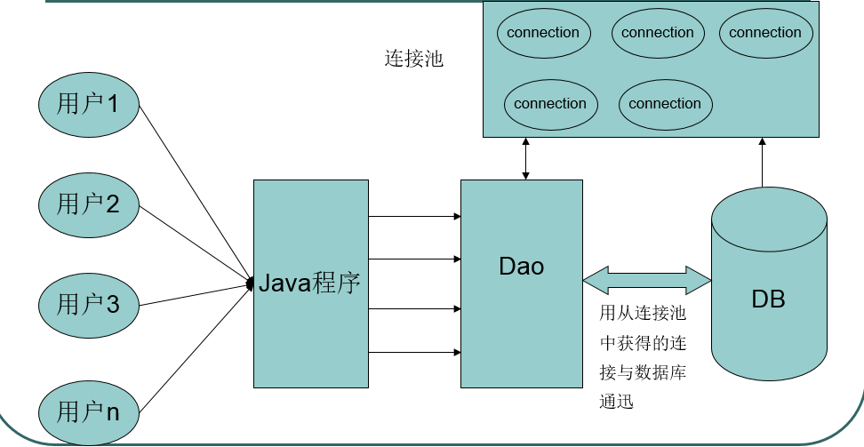
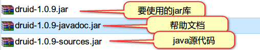

# day18-连接池 #

## 学习目标

1. 能够理解连接池解决现状问题的原理
2. 能够使用C3P0连接池
3. 能够使用DRUID连接池
4. 能够编写C3P0连接池工具类 

## 一,自定义连接池 ##

### 1.为什么要使用连接池 ###

​	Connection对象在JDBC使用的时候就会去创建一个对象,使用结束以后就会将这个对象给销毁了(close).每次创建和销毁对象都是耗时操作.需要使用连接池对其进行优化.

​	程序初始化的时候，初始化多个连接,将多个连接放入到池(集合)中.每次获取的时候,都可以直接从连接池中进行获取.使用结束以后,将连接归还到池中.

### 2.生活里面的连接池例子

- 老方式:

  ​	下了地铁需要骑车, 跑去生产一个, 然后骑完之后,直接把车销毁了.

- 连接池方式 摩拜单车:

  ​	骑之前, 有一个公司生产了很多的自行车, 下了地铁需要骑车, 直接扫码使用就好了, 然后骑完之后, 还回去


### 3.连接池原理【重点】 ###



1. 程序一开始就创建一定数量的连接，放在一个容器中，这个容器称为连接池(相当于碗柜/容器)。
2. 使用的时候直接从连接池中取一个已经创建好的连接对象。
3. 关闭的时候不是真正关闭连接，而是将连接对象再次放回到连接池中。

### 4.自定义连接池初级版本

- 创建一个类,定义LinkedList集合作为连接池,在静态代码块中,向集合里面添加5个连接对象
- 添加addBack()方法,用作归还连接


- 代码:

```java
/**
 * 自定义连接池的类
 * - 创建一个类,定义LinkedList集合作为连接池,在静态代码块中,向集合里面添加5个连接对象
 * - 添加addBack()方法,用作归还连接
 */
public class MyDataSource {
    //定义集合,存放连接对象
    private static LinkedList<Connection> pool;

    //初始化集合, 存放连接对象; Ctrl+Alt+T: 捕获异常
    static{
        try {
            pool = new LinkedList<Connection>();
            //添加5个连接对象
            for(int i = 0; i < 5;i++){
                //创建连接(在工具类里面)
                Connection connection = JdbcUtils.getConnection();
                pool.add(connection);
            }
        } catch (Exception e) {
            e.printStackTrace();
        }
    }

    /**
     * 获得池子里面连接的数量
     * @return
     */
    public static int getCount(){
        return pool.size();
    }

    /**
     * 从pool里面拿出连接
     * @return
     */
    public  Connection getConnection(){
        Connection connection = pool.removeFirst();
        return  connection;
    }

    /**
     * 归还连接
     * @param connection
     */
    public  void addBack(Connection connection){
        pool.addLast(connection);
    }


}
```

### 5.自定义连接池进阶版本(实现datasource)

#### 5.1datasource接口概述

​	Java为数据库连接池提供了公共的接口：javax.sql.DataSource，各个厂商(用户)需要让自己的连接池实现这个接口。这样应用程序可以方便的切换不同厂商的连接池！


#### 5.2代码实现

```java
/**
 * 自定义连接池的类(实现DataSource接口)
 * - 创建一个类,定义LinkedList集合作为连接池,在静态代码块中,向集合里面添加5个连接对象
 * - 添加addBack()方法,用作归还连接
 */
public class MyDataSource implements DataSource{

    //定义集合,存放连接对象
    private static LinkedList<Connection> pool;

    //初始化集合, 存放连接对象; Ctrl+Alt+T: 捕获异常
    static{
        try {
            pool = new LinkedList<Connection>();
            //添加5个连接对象
            for(int i = 0; i < 5;i++){
                //创建连接(在工具类里面)
                Connection connection = JdbcUtils.getConnection();
                pool.add(connection);
            }
        } catch (Exception e) {
            e.printStackTrace();
        }
    }

    /**
     * 获得池子里面连接的数量
     * @return
     */
    public static int getCount(){
        return pool.size();
    }

    /**
     * 归还连接
     * @param connection
     */
    public  void addBack(Connection connection){
        pool.addLast(connection);
    }

    @Override
    /**
     * 从池子里面获得Connection对象
     */
    public Connection getConnection() throws SQLException {
        Connection connection = pool.removeFirst();
        return connection;
    }
  	.... 
  }
```

#### 5.3编写连接池遇到的问题

- 实现dataSource接口后,addBack()不能调用了.
- 能不能不引入新的api,直接调用之前的API.close(),但是这个close不是关闭,是归还

#### 5.4解决办法

- 继承

  ```
  条件:可以控制父类, 最起码知道父类的名字
  ```


- 装饰者模式

  作用：改写已存在的类的某个方法或某些方法

  ```
  条件:1.增强类和被增强类实现的是同一个接口
  	 2.增强类里面要拿到被增强类的引用
  ```


- 动态代理(后面会讲)

### 6.自定义连接池进阶终极版本

#### 6.1装饰者模式概述

- 什么是装饰者模式

      	装饰者模式，是 23种常用的面向对象软件的设计模式之一.  动态地将责任附加到对象上。若要扩展功能，装饰者提供了比继承更加有弹性的替代方案。

  ​	装饰者的作用：改写已存在的类的某个方法或某些方法, 增强方法的逻辑

- 使用装饰者模式需要满足的条件

  - 增强类和被增强类实现的是同一个接口
  - 增强类里面要拿到被增强类的引用

#### 6.2装饰者模式的使用【重点】

实现步骤:

1. 增强类(WrapperCar)和被增强类(Qq)需要实现同一个接口
2. 增强类里面需要得到被增强类的引用(就是把Qq开到改装店, 通过构造方法传递进去)
3. 对于不需要改写(stop)的方法，调用被增强类原有的方法。
4. 对于需要改写(run)的方法，写自己的代码

+ 接口: Car.java

```java
/**
 * 车的规范
 */
public interface Car {

    void run();

    void stop();
}
```

+ 被增强的类: Qq.java

```java
/**
 * QQ厂商(被增强的类)
 */
public class Qq implements Car {


    @Override
    public void run() {
        System.out.println("Qq可以跑60迈...");
    }

    @Override
    public void stop() {
        System.out.println("Qq刹车...");

    }
}
```

+ 增强的类: WrapperCar.java

```java
/**
 * 改装店(增强的类)
 */
public class WrapperCar implements  Car{
    //需要把Qq车开进来(增强类(WrapperCar)里面需要得到被增强类(Qq)的引用)

   private Car car;
    public WrapperCar(Car car) {
        this.car = car;
    }

    @Override
    //需要增强(写自己的逻辑)
    public void run() {
        System.out.println("5s破百..");

    }

    @Override
    //不需要增强(调用之前的逻辑)
    public void stop() {
        car.stop();
    }
}
```

#### 6.3代码实现


## 二,第三方连接池【重点】

### 1.常用连接池    ###

​	通过前面的学习，我们已经能够使用所学的基础知识构建自定义的连接池了。其目的是锻炼大家的基本功，帮助大家更好的理解连接池的原理, 但现实是残酷的，我们所定义的 连接池 和第三方的连接池相比，还是显得渺小. 工作里面都会用第三方连接池.  常见的第三方连接池如下: 

+ C3P0是一个开源的JDBC连接池，它实现了数据源和JNDI绑定，支持JDBC3规范和JDBC2的标准扩展。C3P0是异步操作的，所以一些操作时间过长的JDBC通过其它的辅助线程完成。目前使用它的开源项目有Hibernate，Spring等。C3P0有自动回收空闲连接功能
+ 阿里巴巴-德鲁伊druid连接池：Druid是阿里巴巴开源平台上的一个项目，整个项目由数据库连接池、插件框架和SQL解析器组成。该项目主要是为了扩展JDBC的一些限制，可以让程序员实现一些特殊的需求。
+ DBCP(DataBase Connection Pool)数据库连接池，是Apache上的一个Java连接池项目，也是Tomcat使用的连接池组件。dbcp没有自动回收空闲连接的功能。

### 2.C3P0 

#### 2.1 c3p0介绍


+ C3P0开源免费的连接池！目前使用它的开源项目有：Spring、Hibernate等。使用第三方工具需要导入jar包，c3p0使用时还需要添加配置文件c3p0-config.xml.
+ 使用C3P0需要添加c3p0-0.9.1.2.jar


#### 2.2c3p0的使用

##### 2.2.1通过硬编码来编写【了解】

```java
ComboPooledDataSource cpds = new ComboPooledDataSource();
cpds.setDriverClass("com.mysql.jdbc.Driver");
cpds.setJdbcUrl("jdbc:mysql://localhost:3306/web10"); 
cpds.setUser("root");
cpds.setPassword("123456");
			
Connection connection = cpds.getConnection();
```

##### 2.2.2 通过配置文件来编写【重点】

+ 编写配置文件c3p0-config.xml，放在src目录下（注：文件名一定不要改)

```xml
<c3p0-config>
	<default-config>
		<property name="driverClass">com.mysql.jdbc.Driver</property>
		<property name="jdbcUrl">jdbc:mysql://localhost:3306/web11</property>
		<property name="user">root</property>
		<property name="password">123456</property>
		<property name="initialPoolSize">5</property>
	</default-config>
</c3p0-config>
```

+ 编写Java代码 (会自动读取src目录下的c3p0-config.xml,所以不需要我们解析配置文件)

```java
DataSource ds = new ComboPooledDataSource(); 
```

#### 2.3使用c3p0连接池改写工具类【重点】 

​	我们之前写的工具类(JdbcUtils)每次都会创建一个新的连接, 使用完成之后, 都给销毁了; 所以现在我们要使用c3p0来改写工具类. 也就意味着,我们从此告别了JdbcUtils. 后面会使用c3p0写的工具类

```java
/**
 * 目的:
 * 1. 保证DataSource只有一个
 * 2. 提供连接(DataSource获得)
 * 3. 释放资源
 */
public class C3P0Utils {

    //创建C3P0数据源(连接池)
    private static DataSource dataSource = new ComboPooledDataSource();

    /**
     * 从dataSource(连接池)获得连接对象
     *
     * @return
     * @throws Exception
     */
    public static Connection getConnection() throws Exception {
        Connection connection = dataSource.getConnection();
        return  connection;
    }

    /**
     * 释放资源
     *
     * @param resultSet
     * @param statement
     * @param connection
     */
    public static void release(ResultSet resultSet, Statement statement, Connection connection) {
        if (resultSet != null) {
            try {
                resultSet.close();
            } catch (SQLException e) {
                e.printStackTrace();
            }
        }
        if (statement != null) {
            try {
                statement.close();
            } catch (SQLException e) {
                e.printStackTrace();
            }
        }
        if (connection != null) {
            try {
                connection.close();//看Connection来自哪里, 如果Connection是从连接池里面获得的, close()方法其实是归还; 如果Connection是创建的, 就是销毁
            } catch (SQLException e) {
                e.printStackTrace();
            }
        }
    }

}
```

### 3.DRUID

#### 3.1DRUID介绍

​	Druid是阿里巴巴开发的号称为监控而生的数据库连接池，Druid是国内目前最好的数据库连接池。在功能、性能、扩展性方面，都超过其他数据库连接池。Druid已经在阿里巴巴部署了超过600个应用，经过一年多生产环境大规模部署的严苛考验。如：一年一度的双十一活动，每年春运的抢火车票。

Druid的下载地址：[https://github.com/alibaba/druid](https://github.com/alibaba/druid)  

DRUID连接池使用的jar包：druid-1.0.9.jar




#### 3.2DRUID的使用

##### 3.2.1通过硬编码方式【了解】

```java
       //1. 创建DataSource
        DruidDataSource dataSource = new DruidDataSource();
        dataSource.setDriverClassName("com.mysql.jdbc.Driver");//设置驱动
        dataSource.setUrl("jdbc:mysql://localhost:3306/web17");//设置数据库路径
        dataSource.setUsername("root");//设置用户名
        dataSource.setPassword("123456");//设置密码

        dataSource.setInitialSize(5);//设置初始化连接的数量


        //2. 从数据源里面获得Connection
        Connection connection = dataSource.getConnection();
```

##### 3.2.2 通过配置文件方式【掌握】

+ 创建druid.properties, 放在src目录下

```properties
url=jdbc:mysql:///web17
username=root
password=123456
driverClassName=com.mysql.jdbc.Driver
```

+ 编写Java代码

```java
		 //0 根据druid.properties创建配置文件对象
        Properties properties = new Properties();
        // 关联druid.properties文件
        InputStream is = DruidDemo.class.getClassLoader().getResourceAsStream("druid.properties");
        properties.load(is);
        //1. 创建DataSource
        DataSource dataSource = DruidDataSourceFactory.createDataSource(properties);

        //2. 从数据源(连接池)获得连接对象
        Connection connection = dataSource.getConnection();
```

##### 3.2.3 作业(必做)

+ 用配置文件的方式使用druid, 抽取成DruidUtils(类似C3P0Utils)


## 三,JDBC事务的处理

### 1.概述

​	之前我们是使用MySQL的命令来操作事务。接下来我们使用JDBC来操作银行转账的事务

```
start transaction;    开启事务      connection.setAutoCommit(false);
操作数据库						    操作数据库
commit;				  提交		  connection.commit();
rollback;             回滚		  connection.rollback();
```

### 2.相关的API

| Connection中与事务有关的方法               | **说明**                                   |
| --------------------------------- | ---------------------------------------- |
| setAutoCommit(boolean autoCommit) | 参数是true或false  如果设置为false，表示关闭自动提交，相当于开启事务 |
| void commit()                     | 提交事务                                     |
| void rollback()                   | 回滚事务                                     |

### 3.代码实现

+ 数据库的准备

```
create table account(
    id int primary key auto_increment,
    name varchar(20),
    money double
);

insert into account values (null,'zs',1000);
insert into account values (null,'ls',1000);
insert into account values (null,'ww',1000);
```

+ 代码实现

```java
/**
 * 转账的代码
 */
public class TransferDemo {

    @Test
    public void fun01() throws SQLException {
        Connection connection = null;
        PreparedStatement p1= null;
        PreparedStatement p2 = null;
        try {
            //1. 获得Connection
            connection = C3P0Utils.getConnection();

            //************开启事务
            connection.setAutoCommit(false);

            //2. 创建预编译sql语句对象
            String sql = "update account set money =  money - ? where name = ?";
             p1 = connection.prepareStatement(sql);
            //执行钱减少
            p1.setDouble(1,100.0);
            p1.setString(2,"zs");
            p1.executeUpdate();


            int i = 1/0;//模拟出错

            String sql2 = "update account set money =  money + ? where name = ?";
            p2 = connection.prepareStatement(sql2);
            //执行钱增加
            p2.setDouble(1,100.0);
            p2.setString(2,"ls");
            p2.executeUpdate();


            //************提交事务
            connection.commit();


        } catch (Exception e) {
            e.printStackTrace();
            //************回滚事务
            connection.rollback();
        }finally {
            //3. 释放资源
            p1.close();
            p2.close();
            connection.close();
        }

    }


}
```